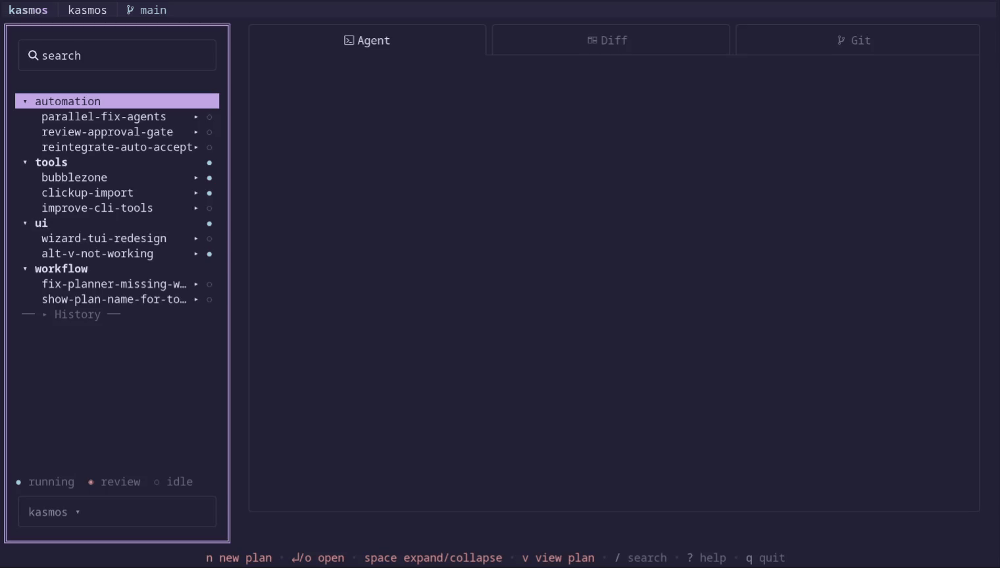

# kasmos [](https://github.com/kastheco/kasmos/actions/workflows/build.yml) [](https://github.com/kastheco/kasmos/releases/latest) [](https://www.gnu.org/licenses/agpl-3.0)

> harness & model-agnostic ai orchestration tool with automated wave-based implementation — powered by superpowers, tmux, and git worktrees.



---

## what it does

kasmos turns your terminal into a multi-agent control center. each task gets its own isolated git worktree and a fresh tmux session at every lifecycle stage: a planner agent writes the implementation plan, coder agents execute it wave by wave, and a reviewer agent validates the result — all managed from a single tui.

- **plan-centric workflow** — create plans with name + description, organize into topics, track status through the full lifecycle (planning → implementing → reviewing → done)
- **wave orchestration** — plans are split into waves; kasmos automatically runs parallel agents per wave, advancing only when all tasks pass
- **isolated workspaces** — every plan gets a dedicated git worktree and tmux session; no branch conflicts, no shared state
- **live agent preview** — the center pane embeds a live terminal so you can watch agents work without leaving kasmos
- **diff + git views** — review changes and git history before merging, right inside the TUI
- **auto-accept mode** — run agents unattended with a background daemon handling permission prompts

---

## installation

#### homebrew

```bash
brew install kastheco/tap/kasmos
```

#### go install

```bash
go install github.com/kastheco/kasmos@latest
```

#### install script

```bash
curl -fsSL https://raw.githubusercontent.com/kastheco/kasmos/main/install.sh | bash
```

installs the `kasmos` binary to `~/.local/bin`. to install with a custom name:

```bash
curl -fsSL https://raw.githubusercontent.com/kastheco/kasmos/main/install.sh | bash -s -- --name kq
```

#### download binary

pre-built binaries for macOS, linux, and windows are on the [releases page](https://github.com/kastheco/kasmos/releases/latest).

---

## prerequisites

- [tmux](https://github.com/tmux/tmux/wiki/Installing)
- [gh](https://cli.github.com/)
- at least one supported AI CLI: **[opencode](https://github.com/sst/opencode)**, [claude code](https://github.com/anthropics/claude-code), [codex](https://github.com/openai/codex), [gemini CLI](https://github.com/google-gemini/gemini-cli), [amp](https://ampcode.com), or [aider](https://aider.chat)

---

## getting started

run from within a git repository:

```bash
kasmos
```

on first run, use the setup wizard to configure your agent harnesses and install skills:

```bash
kasmos setup
```

the wizard detects installed agent CLIs, lets you assign roles (planner / coder / reviewer), and scaffolds the project files kasmos needs.

---

## usage

```
usage:
  kasmos [flags]
  kasmos [command]

available commands:
  setup       configure agent harnesses, install skills, and scaffold project files
  plan        manage plan lifecycle (list, set-status, transition, implement)
  serve       start the plan store http server (sqlite-backed)
  reset       reset all stored instances and clean up tmux sessions and worktrees
  debug       print debug information like config paths
  version     print the version number

flags:
  -p, --program string   agent to use for new instances (e.g. 'opencode', 'codex', 'aider --model ...')
  -y, --autoyes          automatically accept all agent prompts (experimental)
  -h, --help             help for kasmos
```

### keybindings

| key | action |
|-----|--------|
| `n` | new plan |
| `/` | search plans |
| `space` | open context menu |
| `tab` | cycle focus (sidebar → list → preview) |
| `↑ / ↓` or `j / k` | navigate |
| `i` | interactive mode (focus agent pane) |
| `ctrl-q` | exit interactive mode |
| `?` | help |
| `q` | quit |

---

## how it works

1. **plans** live in `docs/plans/` as markdown files — kasmos tracks state in a local json file or a remote [plan store](#plan-store-remote-state)
2. **topics** group related plans and act as collision domains (only one plan per topic can implement at a time)
3. **waves** divide implementation into phases — kasmos parses `## Wave N` headers and runs each wave's tasks in parallel
4. **agents** are spawned in isolated tmux sessions with dedicated git worktrees; the TUI shows live output in the preview pane
5. **review** is automated — a reviewer agent checks the implementation, and kasmos prompts for merge/PR approval before closing the plan

---

## plan store (remote state)

by default, plan state lives in a local `docs/plans/plan-state.json` file — git-tracked, which can cause merge conflicts when running parallel worktrees or working across machines. the plan store replaces this with a sqlite-backed http server.

#### start the server

```bash
kas serve
```

defaults to `0.0.0.0:7433` with the database at `~/.config/kasmos/plans.db`. override with flags:

```bash
kas serve --port 8080 --db /path/to/plans.db --bind 127.0.0.1
```

#### connect kasmos to the store

add one line to `~/.config/kasmos/config.toml`:

```toml
plan_store = "http://localhost:7433"
```

for cross-machine access (e.g. over tailscale):

```toml
plan_store = "http://your-desktop:7433"
```

on startup, kasmos pings the store — if unreachable it falls back to the local json file with a toast warning. no data loss either way.

#### migrate existing plans

a migration script is included in `contrib/`. it's insert-only — existing entries in the store are skipped:

```bash
# start the server first, then:
./contrib/import-plans.sh
```

the script auto-detects `docs/plans/plan-state.json`, the default store url, and the project name from git. all three can be overridden:

```bash
./contrib/import-plans.sh path/to/plan-state.json http://host:7433 my-project
```

#### run as a systemd service

a unit file is provided in `contrib/kasmosdb.service`:

```bash
cp contrib/kasmosdb.service ~/.config/systemd/user/
systemctl --user daemon-reload
systemctl --user enable --now kasmosdb
```

#### rest api

the store exposes a simple rest api for scripting:

```bash
# health check
curl http://localhost:7433/v1/ping

# list all plans
curl http://localhost:7433/v1/projects/kasmos/plans

# filter by status
curl 'http://localhost:7433/v1/projects/kasmos/plans?status=ready'

# filter by topic
curl 'http://localhost:7433/v1/projects/kasmos/plans?topic=bugs'
```

---

## configuration

config lives at `~/.config/kasmos/config.toml`. locate it with:

```bash
kasmos debug
```

key settings:

```toml
plan_store = "http://localhost:7433"  # remote plan store (optional)
```

---

## attribution

kasmos is a fork of [claude-squad](https://github.com/smtg-ai/claude-squad) by smtg-ai.

---

## license

[AGPL-3.0](LICENSE.md)
