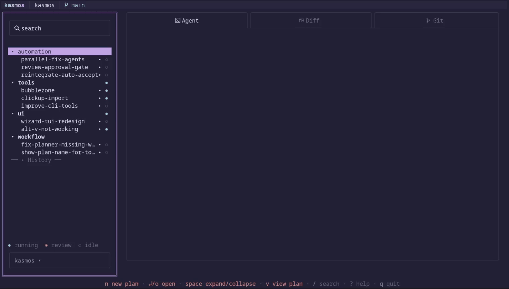

# kasmos [](https://github.com/kastheco/kasmos/actions/workflows/build.yml) [](https://github.com/kastheco/kasmos/releases/latest) [](LICENSE.md)

> mcp-first multi-agent orchestration for git repos: task store, streamable-http mcp server, daemon, worktrees, and tui in one tool.



---

## what kasmos is now

kasmos is no longer just a tmux-driven terminal ui.

it now combines:

- a **repo-local task store** at `<repo-root>/.kasmos/taskstore.db`
- a **streamable http MCP server** exposed by `kas serve`
- a **rest api** for remote task-store access
- a **setup/scaffold system** that writes per-harness agent configs
- the **tui + daemon** that orchestrate planning, implementation, review, and fixes

the current flow is:

1. run `kas setup` inside a git repo
2. start `kas serve` to expose rest + mcp
3. point your mcp-aware clients at `http://127.0.0.1:7434/mcp`
4. use `kas` to manage tasks, instances, and orchestration

today, step 2 is still explicit: `kas setup` does not configure/start the server for you, and launching `kas` does not auto-spawn `kas serve` if it is missing.

---

## install

### homebrew

```bash
brew install kastheco/tap/kasmos
```

### go install

```bash
go install github.com/kastheco/kasmos@latest
ln -sf "$(go env GOPATH)/bin/kasmos" "$(go env GOPATH)/bin/kas"
```

### install script

```bash
curl -fsSL https://raw.githubusercontent.com/kastheco/kasmos/main/install.sh | bash
```

### download release asset

prebuilt release archives are published for macOS and linux on the [releases page](https://github.com/kastheco/kasmos/releases/latest).

> examples below use `kas`. if your machine only has `kasmos`, either use `kasmos` everywhere or add a `kas` symlink.

---

## prerequisites

- git
- tmux
- [gh](https://cli.github.com/)
- at least one supported harness cli: `opencode`, `claude`, or `codex`

---

## quick start

from inside a git repo:

```bash
kas setup
kas serve --bind 127.0.0.1 --port 7433 --mcp --mcp-port 7434
kas
```

then connect your mcp client to:

```text
http://127.0.0.1:7434/mcp
```

the admin ui is served from the same `kas serve` process at:

```text
http://127.0.0.1:7433/admin/
```

---

## setup wizard

`kas setup` writes project-local config and scaffold files for the harnesses you select.

useful variants:

```bash
kas setup
kas setup --force
kas setup --force --clean
```

- `--clean` ignores the existing `.kasmos/config.toml` and starts from factory defaults
- `--force` overwrites existing scaffolded files

important: `kas setup --force --clean` **does not delete stale files for harnesses you stop using**. it rewrites the selected harness/config paths, but if you are doing a major migration and want a truly clean harness layout, remove stale `.claude/`, `.opencode/`, `.codex/`, or `.agents/skills/` content yourself first.

the wizard/scaffolder writes paths like:

- `.kasmos/config.toml`
- `.agents/skills/`
- `.claude/agents/`
- `.opencode/agents/`
- `.opencode/opencode.jsonc`
- `.codex/AGENTS.md`

after setup, verify scaffold health with:

```bash
kas check -v
```

`kas setup` currently scaffolds harness config only; it does **not** provision or launch the repo's MCP/REST server.

---

## mcp server

`kas serve` starts two surfaces by default:

- rest api on `--port` (default `7433`)
- streamable-http mcp server on `--mcp-port` (default `7434`)

run it locally:

```bash
kas serve --bind 127.0.0.1 --port 7433 --mcp --mcp-port 7434
```

if you want this to be always-on, run `kas serve` under your user service manager or keep it paired with the daemon in your own startup scripts for now.

if you do **not** want to launch multiple commands every session, run the server + daemon as user services.

for packaged installs (brew / release binary), create the units directly:

```bash
mkdir -p ~/.config/systemd/user

cat > ~/.config/systemd/user/kasmosdb.service <<'EOF'
[Unit]
Description=kasmos task store and mcp server
After=network.target

[Service]
Type=simple
ExecStart=%h/.local/bin/kas serve
Restart=on-failure
RestartSec=5
Environment=HOME=%h

[Install]
WantedBy=default.target
EOF

cat > ~/.config/systemd/user/kasmos.service <<'EOF'
[Unit]
Description=kasmos orchestration daemon
After=network.target

[Service]
Type=simple
ExecStart=%h/.local/bin/kas daemon start --foreground
ExecStop=%h/.local/bin/kas daemon stop
Restart=on-failure
RestartSec=5
Environment=HOME=%h

[Install]
WantedBy=default.target
EOF

systemctl --user daemon-reload
systemctl --user enable --now kasmosdb kasmos
```

if your `kas` binary lives somewhere else, replace `%h/.local/bin/kas` with the real path from `command -v kas`.

for source checkouts, `just services-enable` still works.

after that, your normal interactive entrypoint can just be:

```bash
kas
```

common flags:

```bash
kas serve --help
```

currently the kasmos mcp server exposes tool groups for:

- filesystem: `find_files`, `list_dir`, `read_file`, `grep`
- git: `git_status`, `git_diff`, `git_log`
- task store: `task_list`, `task_show`, `task_create`, `task_update_content`, `task_transition`
- signals: `signal_create`
- instances: `instance_list`, `instance_pause`, `instance_resume`, `instance_send`
- daemon: `daemon_status`

filesystem and git tools are sandboxed to the current working directory plus the resolved repo root.

---

## how to configure your local mcp client

### generic / claude-style `.mcp.json`

create a project-local `.mcp.json`:

```json
{
  "mcpServers": {
    "kasmos": {
      "type": "http",
      "url": "http://127.0.0.1:7434/mcp"
    }
  }
}
```

that is the simplest option for any client that supports standard `mcpServers` http entries.

### opencode remote mcp config

if you want to wire the same kasmos server into opencode, add a remote mcp entry to your opencode config:

```jsonc
{
  "mcp": {
    "kasmos": {
      "type": "remote",
      "url": "http://127.0.0.1:7434/mcp",
      "enabled": true
    }
  }
}
```

you can place that in project-local opencode config alongside the scaffolded `.opencode/opencode.jsonc` content, or in your global opencode config if you want it everywhere.

### remote / multi-machine use

if another machine should use the same task store, point it at the rest api in `.kasmos/config.toml`:

```toml
database_url = "http://your-host:7433"
```

then run `kas serve` on the machine that hosts the sqlite db.

---

## current config location

kasmos now anchors project state to the repo root.

- config: `<repo-root>/.kasmos/config.toml`
- task store: `<repo-root>/.kasmos/taskstore.db`
- signals: `<repo-root>/.kasmos/signals/`

show the resolved paths with:

```bash
kas debug
```

---

## useful commands

```bash
kas task list
kas task list --status implementing
kas task show <task-file>
kas task create <name>
kas task register <task-file>
kas task update-content <task-file>
kas task transition <task-file> <event>
kas task set-status <task-file> <status> --force
kas task implement <task-file> [--wave N]

kas serve
kas scaffold sync
kas daemon start
kas monitor
kas status
```

---

## upgrading your local machine to the new mcp-first release

once `v2.0.0-beta` is published, upgrade with one of these:

### homebrew

```bash
brew update
brew upgrade kasmos
```

### go install

```bash
go install github.com/kastheco/kasmos@v2.0.0-beta
ln -sf "$(go env GOPATH)/bin/kasmos" "$(go env GOPATH)/bin/kas"
kas version
```

### install script / release asset

re-run the installer or replace your binary with the `v2.0.0-beta` release asset, then confirm:

```bash
kas version
```

### recommended post-upgrade refresh

```bash
kas setup --force --clean
kas check -v
kas scaffold sync
```

if you changed which harnesses you use, clean stale harness directories manually before rerunning setup.

---

## development

```bash
go test ./...
go build ./...
```

---

## license

[BSL 1.1](LICENSE.md) - converts to [Apache 2.0](https://www.apache.org/licenses/LICENSE-2.0) on the change date.
