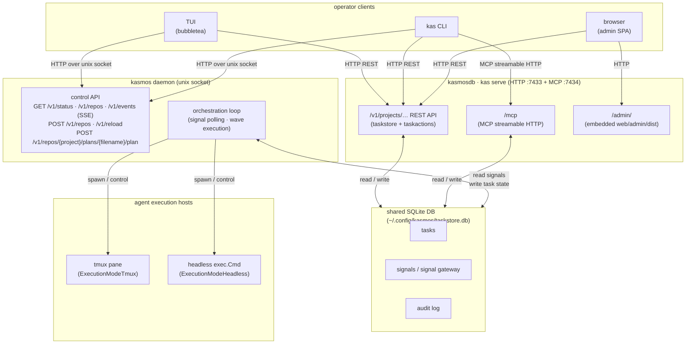

# daemon topology

> **One-paragraph orientation.** kasmos runs as **two separate services**:
> `kasmosdb` runs `kas serve` and owns the shared SQLite database, the REST
> task-store API, the task-action routes, and the embedded admin SPA; `kasmos`
> is the background orchestration daemon that spawns agent sessions and exposes
> a control API over a **Unix-domain socket**. Operator clients (TUI, CLI,
> browser) talk to whichever service they need — they are not required to go
> through one to reach the other.

---

## process topology

### legend

| node | binary / package | key source |
|------|-----------------|------------|
| `kasmosdb · kas serve` | `cmd/serve.go` | `NewServeCmd()` |
| `/mcp` | `internal/mcpserver` | `newServeMCPServer()` |
| `/admin/` | `web/admin_assets.go` | `webassets.AdminFS()` (embedded `web/admin/dist`) |
| `kasmos daemon` | `daemon/daemon.go` | `Daemon` struct |
| unix-socket control API | `daemon/api/server.go` | `NewHandlerWithBroadcaster()`, `ListenUnix()` |
| `/v1/events` SSE | `daemon/api/server.go` | `EventBroadcaster.Subscribe()` |
| shared SQLite DB | `config/taskstore/` | `OpenSharedDB()` |
| `tmux` host | `session/execution.go` | `ExecutionModeTmux` |
| `headless` host | `session/execution.go` | `ExecutionModeHeadless` |

---

## transport notes

**Daemon control API — Unix-domain socket HTTP.**  
The daemon listens on a Unix-domain socket whose path is resolved by
`ResolvedDaemonSocketPath()` (`config/taskstore/unix_client.go`). The default
path is `$XDG_RUNTIME_DIR/kasmos/kas.sock`; override via `socket_path` in
`~/.config/kasmos/daemon.toml`. Clients dial the socket with a custom
`http.Transport` and speak plain HTTP/1.1 — no TLS.

**`kas serve` task-store and MCP — normal TCP HTTP.**  
`kas serve` binds to `:7433` (REST/admin) and `:7434` (MCP) by default.
Because it has no built-in authentication, binding to a non-loopback address
(e.g. `0.0.0.0`) emits a warning; front it with Tailscale, an SSH tunnel, or a
reverse proxy in multi-user deployments.

**Admin SPA.**  
The `/admin/` subtree is served from assets embedded at build time via
`web/admin_assets.go`. Pass `--admin-dir dist/` to `kas serve` to hot-reload a
local build without recompiling.

---

## service names and restart commands

The two services use the names `kasmosdb` and `kasmos` as defined in
`internal/platform/service.go`.

| service | unit name | restart (Linux) |
|---------|-----------|-----------------|
| task-store server | `kasmosdb` | `systemctl --user restart kasmosdb` |
| orchestration daemon | `kasmos` | `systemctl --user restart kasmos` |

To start both at once: `systemctl --user start kasmosdb kasmos`
(returned by `RestartServicesCommand()` on Linux).

On macOS, launchd plists (`com.kasmos.taskstore.plist` and
`com.kasmos.daemon.plist`) serve the same role; see
`internal/platform/service.go` for the exact `launchctl` invocations.

---

## see also

| page | what it adds |
|------|-------------|
| [signal-flow.md](signal-flow.md) | how signals travel from agent → gateway → daemon loop → FSM |
| [task-fsm.md](task-fsm.md) | task state machine: valid statuses, events, and transitions |
| [source-of-truth.md](source-of-truth.md) | where each piece of state lives and the factory layer behind it |
