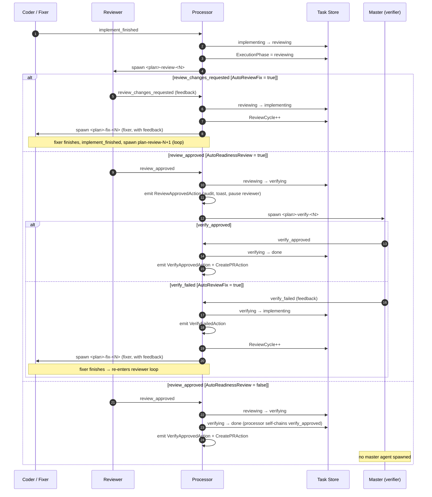

# review cycle

> **source files:**
> [`orchestration/lifecycle_agents.go`](../../orchestration/lifecycle_agents.go) ·
> [`orchestration/loop/processor.go`](../../orchestration/loop/processor.go) ·
> [`daemon/config.go`](../../daemon/config.go) ·
> [`config/taskfsm/fsm.go`](../../config/taskfsm/fsm.go) ·
> [`docs/lifecycle-operator-guide.md`](../lifecycle-operator-guide.md)

after a coder or fixer agent finishes, the daemon spawns a reviewer agent. the reviewer's verdict drives two possible branches: a fix loop (when changes are requested) or a master-agent readiness gate (when approved). this page traces both paths.

---

## round numbering

`ReviewCycle` is the number of **completed fixer iterations** persisted on the task entry (starts at 0).

| session title pattern | derived from |
|-----------------------|--------------|
| `<plan>-review-<N>`  | `N = ReviewCycle + 1` (reviewer round) |
| `<plan>-fix-<N>`     | `N = ReviewCycle` (current fix round, set before spawning) |
| `<plan>-verify-<N>`  | `N = ReviewCycle + 1` (verify round) |

round 1 is the initial reviewer pass (`ReviewCycle = 0`, no fixer has run yet).

source: `BuildReviewerAgentSpec`, `BuildFixerAgentSpec`, `BuildMasterAgentSpec` in `orchestration/lifecycle_agents.go`.

---

## sequence diagram

---

## config toggles

both flags are fields on `DaemonConfig` in `daemon/config.go` and loaded from `~/.config/kasmos/daemon.toml`.

| TOML key | Go field | default | effect when disabled |
|---|---|---|---|
| `auto_review_fix` | `AutoReviewFix` | `true` | `review_changes_requested` and `verify_failed` do **not** spawn a fixer; the task halts in `implementing` and waits for manual recovery |
| `auto_readiness_review` | `AutoReadinessReview` | `true` | `review_approved` skips the master agent; the processor self-chains `verify_approved` and the task moves straight to `done` |
| `max_review_fix_cycles` | `MaxReviewFixCycles` | `0` (unlimited) | caps the reviewer→fixer loop; when `ReviewCycle+1 > MaxReviewFixCycles` the processor emits `ReviewCycleLimitAction` instead of spawning a fixer |
| `readiness_self_fix_max_lines` | `ReadinessSelfFixMaxLines` | `80` | net-line ceiling for master-agent self-fixes |
| `readiness_max_verify_cycles` | `ReadinessMaxVerifyCycles` | `2` | deprecated compatibility setting; it never changes a failed verdict into approval |

---

## failed verification is fail-closed

`verify_failed` always applies `verifying → implementing`. It cannot be rewritten
as `verify_approved`, regardless of cycle count or signal origin. When
`auto_review_fix` is enabled, the processor spawns a fixer; use
`max_review_fix_cycles` to bound automatic fixer loops. Once that limit is
reached, the task remains in `implementing` for operator recovery.

`readiness_max_verify_cycles` remains loadable so existing configs do not break,
but it no longer affects lifecycle admission.

---

## operator recovery

use `kas task recover <task-file>` to manually drive the cycle:

| action | applies when |
|--------|--------------|
| `review-approved` | task is in `reviewing` |
| `review-changes --feedback …` | task is in `reviewing` |
| `verify-approved` | task is in `verifying` (master agent active) |
| `verify-failed --feedback …` | task is in `verifying` |

see [`docs/lifecycle-operator-guide.md`](../lifecycle-operator-guide.md) for the full list of recovery actions and TUI equivalents.

---

## real files

| file | role |
|------|------|
| `orchestration/lifecycle_agents.go` | `BuildReviewerAgentSpec`, `BuildFixerAgentSpec`, `BuildMasterAgentSpec`, round-number logic |
| `orchestration/loop/processor.go` | `ProcessFSMSignals`, `shouldForcePromoteVerify`, review/verify action dispatch |
| `daemon/config.go` | `DaemonConfig`: `AutoReviewFix`, `AutoReadinessReview`, `MaxReviewFixCycles`, `ReadinessMaxVerifyCycles` |
| `config/taskfsm/fsm.go` | FSM edges: `reviewing → verifying`, `verifying → done`, `verifying → implementing` |

---

## see also

| page | what it adds |
|------|-------------|
| [task-fsm.md](task-fsm.md) | the complete state machine powering the reviewing / verifying transitions |
| [wave-execution.md](wave-execution.md) | what happens before the reviewer is spawned (wave orchestration) |
| [signal-flow.md](signal-flow.md) | how `review_approved` and `verify_approved` signals travel from agent to daemon |
