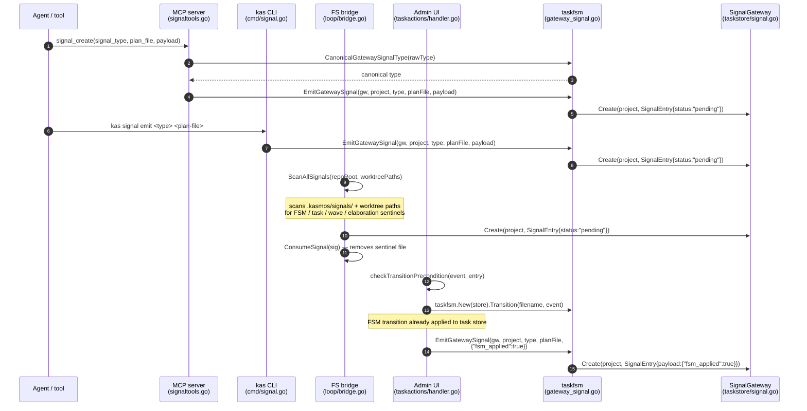
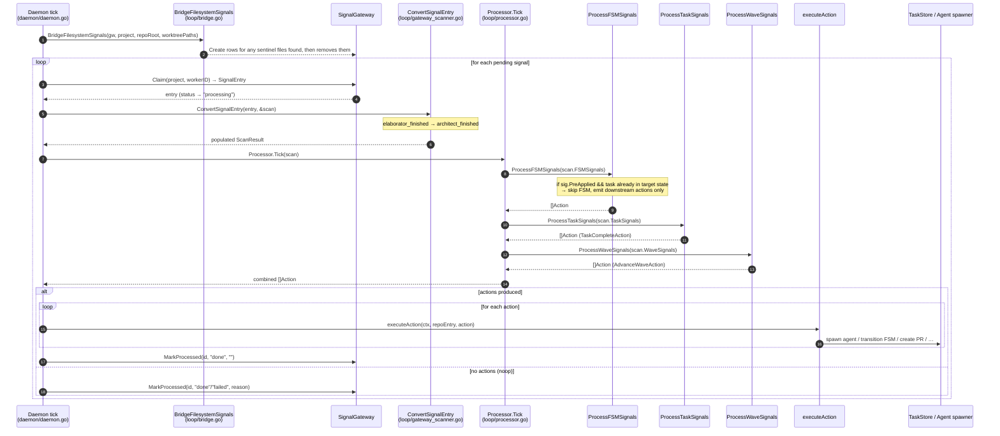

# Signal Flow

Signals are the message bus that advances task lifecycles and triggers agent
spawning. The system has two distinct halves: **ingress** (inserting a pending
row into the gateway) and **processing** (the daemon claiming that row and
executing side effects). The two halves share no direct coupling; the gateway
database is the handoff point.

---

## Diagram 1 — Ingress: paths into the signal gateway

Four independent callers can create a pending gateway row. They converge on
`taskfsm.EmitGatewaySignal` (or call `SignalGateway.Create` directly in the
bridge case) and finish when a `pending` row exists in the SQLite signals table.



### Ingress notes

| Path | Source file | Who calls `EmitGatewaySignal` |
|------|-------------|-------------------------------|
| MCP `signal_create` | `internal/mcpserver/signaltools/signaltools.go` | `makeSignalCreateHandler` |
| `kas signal emit` | `cmd/signal.go` → `executeSignalEmit` | delegates to `taskfsm` |
| FS sentinel bridge | `orchestration/loop/bridge.go` → `BridgeFilesystemSignals` | calls `gw.Create` directly |
| Admin HTTP `POST …/transition` | `config/taskactions/handler.go` → `handleTransition` | emits after FSM is applied |

**`fsm_applied` fast-path** — the admin HTTP handler is the only ingress path
that pre-applies the FSM transition before emitting the gateway row. It marks
the payload `{"fsm_applied":true}` so the daemon processor knows to skip the
FSM step and jump straight to side effects (spawn reviewer, spawn master, create
PR, etc.). All other ingress paths leave FSM application to the daemon.

**`elaborator_finished` wire name** — the architect-pass completion signal is
stored in the gateway as `elaborator_finished` (legacy wire contract). During
decoding in `ConvertSignalEntry`, this is immediately remapped to the internal
`architect_finished` event (`taskfsm.ArchitectFinished`). No other code path
should produce or consume the `elaborator_finished` string after the gateway
decode step.

---

## Diagram 2 — Processing: daemon consumption path

The daemon polls each repo's gateway on every tick. It bridges any lingering
filesystem sentinels first, then claims and processes pending rows one at a time.



### Processing notes

| Step | Code location | Purpose |
|------|--------------|---------|
| `BridgeFilesystemSignals` | `orchestration/loop/bridge.go` | drains `.kasmos/signals/` sentinels into the gateway before the claim loop |
| `Claim` | `config/taskstore/signal_sqlite.go` | atomic row ownership; sets status → `processing` |
| `ConvertSignalEntry` | `orchestration/loop/gateway_scanner.go` | decodes payload; maps `elaborator_finished` → `architect_finished` |
| `Processor.Tick` | `orchestration/loop/processor.go` | dispatches to `ProcessFSMSignals`, `ProcessTaskSignals`, `ProcessWaveSignals`, `ProcessElaborationSignals` |
| `executeAction` | `daemon/daemon.go` | runs side effects: spawn agent, FSM transition, create PR, etc. |
| `MarkProcessed` | `config/taskstore/signal_sqlite.go` | sets final status (`done` or `failed`) and timestamp |

---

## Side note — stuck-signal recovery

```
┌─────────────────────────────────────────────────────────────────────┐
│  Stuck-signal reaper (daemon background goroutine, every 60 s)      │
│                                                                     │
│  reapStuckSignals(repos, 60 s, logger)                             │
│    └─▶ SignalGateway.ResetStuck(60 s)                              │
│           returns rows stuck in "processing" to "pending"           │
│           so the next daemon tick can re-claim them                 │
└─────────────────────────────────────────────────────────────────────┘
```

If the daemon crashes or is restarted between `Claim` and `MarkProcessed`, a
signal row is left in the `processing` state indefinitely. The background reaper
(`reapStuckSignals` in `daemon/daemon.go`) calls `SignalGateway.ResetStuck` every
60 seconds to return those rows to `pending`, allowing the claim loop to pick
them up again on the next tick. This is a recovery mechanism, not a mainline
path.

---

## Key files

| File | Role |
|------|------|
| `config/taskfsm/gateway_signal.go` | `EmitGatewaySignal`, `CanonicalGatewaySignalType`, type validation |
| `config/taskstore/signal.go` | `SignalGateway` interface, `SignalEntry` struct |
| `config/taskstore/signal_sqlite.go` | SQLite implementation: `Create`, `Claim`, `MarkProcessed`, `ResetStuck` |
| `internal/mcpserver/signaltools/signaltools.go` | MCP `signal_create` tool handler |
| `cmd/signal.go` | `kas signal emit` CLI subcommand |
| `config/taskactions/handler.go` | Admin HTTP transition handler (`fsm_applied` fast-path) |
| `orchestration/loop/bridge.go` | `BridgeFilesystemSignals` — sentinel-to-gateway migration |
| `orchestration/loop/gateway_scanner.go` | `ConvertSignalEntry`, `ScanGateway` |
| `orchestration/loop/processor.go` | `Processor.Tick`, `ProcessFSMSignals`, `ProcessTaskSignals`, `ProcessWaveSignals` |
| `daemon/daemon.go` | Claim loop, `executeAction`, `reapStuckSignals` |
