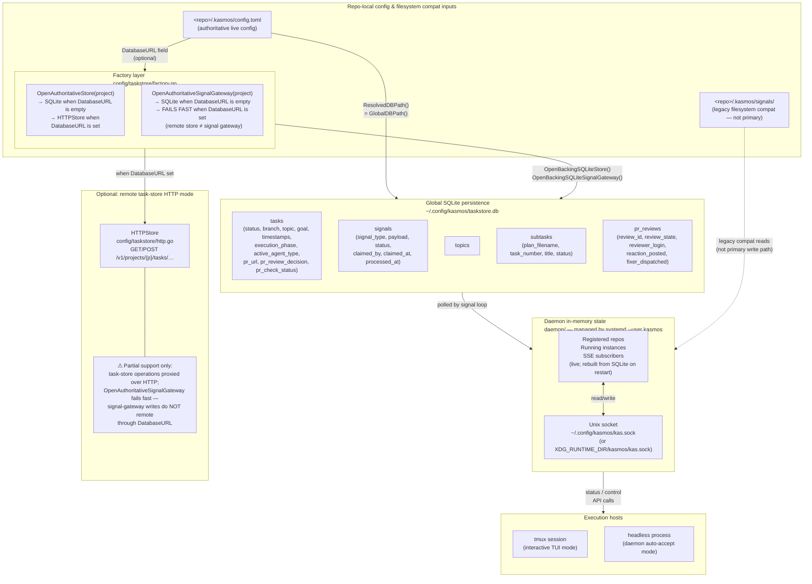

# Source of Truth: Where State Lives

**Audience:** contributors who need to answer "where does this data actually live?"  
**Scope:** task/signal persistence, repo-local config, daemon in-memory state, execution hosts, and optional remote task-store mode.

---

## Ownership map



---

## Legend

| Symbol | Meaning |
|--------|---------|
| solid arrow `-->` | authoritative data flow (writer → reader or bidirectional) |
| dashed arrow `-.->` | legacy / compat path; do not rely on for new code |
| `⚠` callout | partial support — read the note before building on it |

---

## Who writes what

| Data | Writer(s) | Reader(s) |
|------|-----------|-----------|
| `tasks` | daemon signal loop, `kas task` CLI, MCP server | TUI, web admin, `kas task list`, MCP tools |
| `signals` | agent sessions (via `OpenAuthoritativeSignalGateway`), MCP `signal_create` | daemon signal loop |
| `topics` | `kas task create`, MCP task creation | TUI topic filter, `kas task list` |
| `subtasks` | orchestration loop after plan parsing | TUI plan detail pane, web admin |
| `pr_reviews` | daemon PR-poll loop | daemon fixer dispatch |
| daemon in-memory state | daemon internals, Unix-socket API calls | TUI via Unix socket, web admin via Unix socket |
| `<repo>/.kasmos/config.toml` | user (`kas config set`), manual edits | all subsystems at startup via `config.LoadConfig()` |

---

## Key paths

| Path | Purpose |
|------|---------|
| `~/.config/kasmos/taskstore.db` | global SQLite file; shared by task store, signal gateway, and audit log |
| `<repo>/.kasmos/config.toml` | project config; `DatabaseURL` field selects remote task-store mode |
| `<repo>/.kasmos/signals/` | filesystem sentinel directory; legacy compat only — not the primary signal write path |
| `~/.config/kasmos/kas.sock` | daemon Unix socket (default; see `ResolvedDaemonSocketPath()`) |
| `XDG_RUNTIME_DIR/kasmos/kas.sock` | daemon Unix socket when `XDG_RUNTIME_DIR` is set |

---

## Remote task-store limitation

When `DatabaseURL` is set in `config.toml`, `OpenAuthoritativeStore` proxies task operations
to the configured HTTP server (`config/taskstore/http.go`).

**`OpenAuthoritativeSignalGateway` does not follow suit.** The factory explicitly returns an
error when `DatabaseURL` is non-empty:

```
open authoritative signal gateway for project X:
  remote task store "…" does not expose signal gateway access
```

This means:
- Remote mode gives you **task CRUD over HTTP** — useful for shared teams or CI.
- Signal writes (agent lifecycle events, `implement-task-finished`, etc.) **always require
  local SQLite access** regardless of `DatabaseURL`.
- Do not assume a remote `DatabaseURL` is a full kasmos backend replacement.

---

## Factory entry points

| Function | Location | Returns |
|----------|----------|---------|
| `OpenAuthoritativeStore(project)` | `config/taskstore/factory.go` | `Store` (SQLite or HTTP) |
| `OpenAuthoritativeSignalGateway(project)` | `config/taskstore/factory.go` | `SignalGateway` (SQLite only; fails fast if remote) |
| `ResolvedDBPath()` | `config/taskstore/factory.go` | `~/.config/kasmos/taskstore.db` |
| `ResolvedDaemonSocketPath()` | `config/taskstore/unix_client.go` | daemon socket path (toml override → XDG → tempdir) |

---

## real files

| file | role |
|------|------|
| `config/taskstore/factory.go` | `OpenAuthoritativeStore`, `OpenAuthoritativeSignalGateway`, `ResolvedDBPath` |
| `config/taskstore/sqlite.go` | SQLite backing store (`tasks`, `topics`, `subtasks`, `pr_reviews` tables) |
| `config/taskstore/signal_sqlite.go` | SQLite signal gateway (`signals` table, `Create`, `Claim`, `MarkProcessed`, `ResetStuck`) |
| `config/taskstore/http.go` | `HTTPStore` — remote task-store proxy (task CRUD only; no signal gateway) |
| `config/taskstore/unix_client.go` | `ResolvedDaemonSocketPath` — daemon socket path resolution |
| `config/config.go` | `LoadConfig`, `GetConfigDir` — project-local `.kasmos/` anchoring |

---

## see also

| page | what it adds |
|------|-------------|
| [FACTS.md](FACTS.md) | canonical path/function reference extracted from live code with exact line citations |
| [daemon-topology.md](daemon-topology.md) | how the two runtime processes are wired to the shared SQLite DB |
| [signal-flow.md](signal-flow.md) | the gateway signal table lifecycle: `pending → processing → done` |
