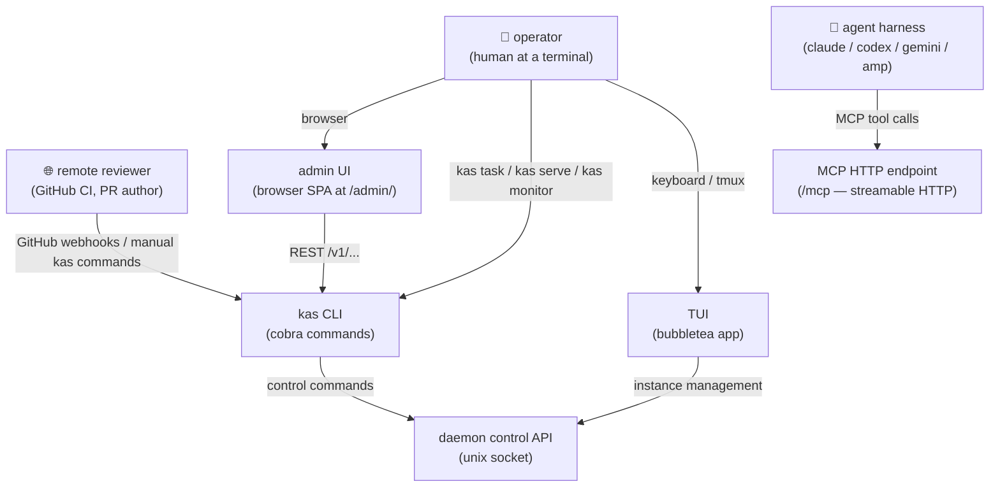
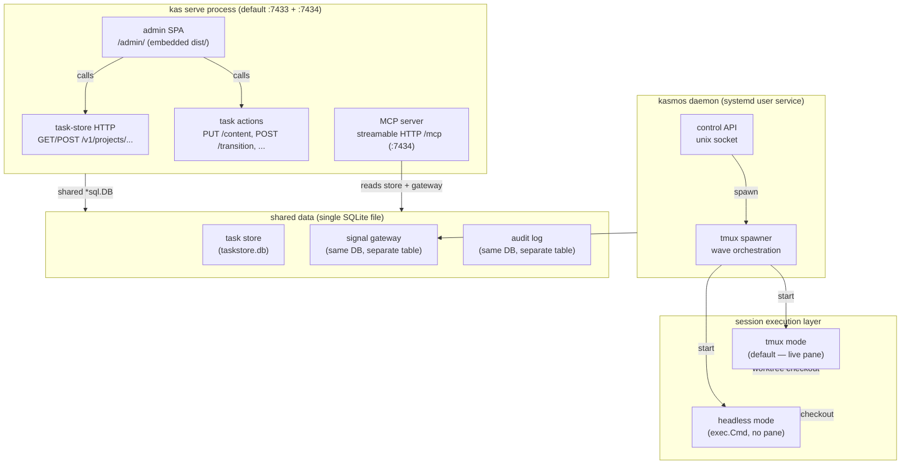

# system context

> **level:** what are the pieces?
> **audience:** new contributors who want to understand the top-level topology before diving into specific flows.

---

## diagram 1 — actors and surfaces

Who talks to kasmos, and through which surface.

**legend**

| surface | transport | primary consumer |
|---------|-----------|-----------------|
| TUI | in-process bubbletea | operator |
| `kas` CLI | exec / subprocess | operator, scripts, CI |
| admin UI | HTTP browser SPA | operator (web) |
| MCP endpoint | streamable HTTP `/mcp` | agent harnesses |
| daemon control API | unix domain socket | TUI, `kas monitor` |

---

## diagram 2 — runtime containers

How the processes are laid out at runtime.

**legend**

| container | process | listen |
|-----------|---------|--------|
| `kas serve` | managed by `kasmosdb` systemd unit | TCP (default `0.0.0.0:7433`, MCP `:7434`) |
| daemon | `kasmos` systemd unit | unix socket (`~/.kasmos/daemon.sock`) |
| task store | in-process SQLite | — |
| signal gateway | in-process SQLite | — |
| tmux session | `tmux new-session` | pty (visible in TUI) |
| headless session | `exec.Cmd` | stdout/stderr only |

---

## why the admin UI lives under `kas serve`, not the daemon

The daemon is a long-running supervisor: it spawns agent instances, tracks their
lifecycle, and manages the unix-socket control API. It deliberately has no knowledge
of HTTP presentation concerns.

`kas serve` owns the task-store REST API and the static asset layer. The admin SPA
is embedded at build time via `web.AdminFS()` (an `embed.FS` rooted at
`web/admin/dist`) and served alongside the `/v1/` REST routes on the same TCP port.
This colocation means the SPA can call the task-store and task-actions APIs with
relative URLs — no CORS, no second origin to configure. Keeping these concerns in one
process also avoids duplicating SQLite connection management; `kas serve` opens a
single `*sql.DB` and shares it across the task store, signal gateway, audit logger,
and MCP server.

If the admin UI were served from the daemon it would need either a second SQLite
connection (reintroducing BUSY contention) or a proxy hop through `kas serve` to
reach the task data — either path adds complexity without benefit.

---

## real files

Open these to follow up on specific pieces:

| concern | entry point |
|---------|-------------|
| `kas serve` HTTP wiring | `cmd/serve.go` — `NewServeCmd()` |
| MCP server construction | `internal/mcpserver/server.go` — `NewServer()` |
| Admin SPA embedding | `web/admin_assets.go` — `AdminFS()` |
| Daemon control API routes | `daemon/api/server.go` — `registerRoutes()` |
| Task-store HTTP handler | `config/taskstore/server.go` |
| Task actions (transition / content) | `config/taskactions/` |
| Session execution modes | `session/execution.go` — `NormalizeExecutionMode()` |
| Signal gateway | `config/taskstore/` (same package as task store) |
