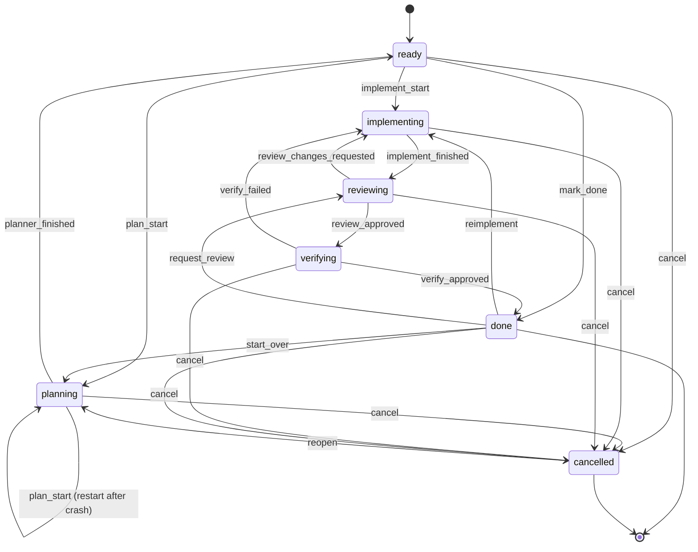

# task fsm

how a task moves through its lifecycle — from `ready` to `done` (or `cancelled`).

**source:** `config/taskfsm/fsm.go` · `config/taskactions/handler.go` · `docs/lifecycle-operator-guide.md`

---

## status diagram

> **note:** `review_approved` moves the task to `verifying`, not directly to `done`. the master agent runs a holistic readiness gate in `verifying`. when the master signals `verify_approved`, the task advances to `done`. when `AutoReadinessReview` is disabled in config, the daemon processor chains `verify_approved` immediately after `review_approved` inside `executeSignalProcess` (`orchestration/loop/processor.go:304-327`), bypassing the master-agent gate. this applies to both the legacy filesystem-signal path and the gateway-backed path.

---

## transition table

exact transitions from `transitionTable` in `config/taskfsm/fsm.go`:

| current status  | event                    | next status    |
|-----------------|--------------------------|----------------|
| `ready`         | `plan_start`             | `planning`     |
| `ready`         | `implement_start`        | `implementing` |
| `ready`         | `mark_done`              | `done`         |
| `ready`         | `cancel`                 | `cancelled`    |
| `planning`      | `plan_start`             | `planning`     |
| `planning`      | `planner_finished`       | `ready`        |
| `planning`      | `cancel`                 | `cancelled`    |
| `implementing`  | `implement_finished`     | `reviewing`    |
| `implementing`  | `cancel`                 | `cancelled`    |
| `reviewing`     | `review_approved`        | `verifying`    |
| `reviewing`     | `review_changes_requested` | `implementing` |
| `reviewing`     | `cancel`                 | `cancelled`    |
| `verifying`     | `verify_approved`        | `done`         |
| `verifying`     | `verify_failed`          | `implementing` |
| `verifying`     | `cancel`                 | `cancelled`    |
| `done`          | `start_over`             | `planning`     |
| `done`          | `reimplement`            | `implementing` |
| `done`          | `request_review`         | `reviewing`    |
| `done`          | `cancel`                 | `cancelled`    |
| `cancelled`     | `reopen`                 | `planning`     |

`ApplyTransition(current Status, event Event) (Status, error)` enforces this table; any transition not listed returns an error.

---

## execution phase / operator phrase table

a second field — `execution_phase` — carries fine-grained detail within a coarse status. this is what the TUI and `kas status` display.

| status          | execution_phase                   | operator phrase              | meaning |
|-----------------|-----------------------------------|------------------------------|---------|
| `ready`         | `planned`                         | planned                      | planning finished; queued for implementation |
| `implementing`  | `architecting`                    | architecting                 | architect pass running before wave work |
| `implementing`  | `wave_running`                    | wave N running               | wave N coder work active |
| `implementing`  | `wave_waiting`                    | waiting for confirmation     | active wave finished; awaiting next handoff |
| `implementing`  | `single_agent_implementing`       | implementing                 | single coder session active |
| `implementing`  | `fixing`                          | fixing round N               | fixer applying round-N review feedback |
| `reviewing`     | `reviewing`                       | reviewing round N            | reviewer running round N |
| `verifying`     | _(empty)_                         | verifying                    | master agent running holistic readiness gate |

`TransitionExecutionState(event Event, next Status)` sets `execution_phase` to `planned` when `planner_finished` → `ready`; all other transitions clear it.

---

## recovery actions

`kas task recover <task-file> --action <action>` is an operator convenience layer, not a separate FSM. each action maps to an existing FSM event:

| recover action              | underlying FSM event           | valid when status is   |
|-----------------------------|--------------------------------|------------------------|
| `planner-finished`          | `planner_finished`             | `planning`             |
| `architect-finished`        | _(no FSM edge; consumed only)_ | `implementing`         |
| `implement-finished`        | `implement_finished`           | `implementing`         |
| `review-approved`           | `review_approved`              | `reviewing`            |
| `review-changes --feedback` | `review_changes_requested`     | `reviewing`            |
| `advance-review-cycle`      | `review_changes_requested`     | `reviewing`            |
| `verify-approved`           | `verify_approved`              | `verifying`            |
| `verify-failed --feedback`  | `verify_failed`                | `verifying`            |

TUI equivalents (context menu → manage): `mark planning finished`, `mark architect finished`, `mark implement finished`.

`architect-finished` is the canonical operator-facing name; the gateway wire name is `elaborator_finished` (compatibility alias — see `docs/lifecycle-operator-guide.md`).

---

## key functions

| function | location | purpose |
|----------|----------|---------|
| `ApplyTransition(current, event)` | `config/taskfsm/fsm.go` | validate and return next status |
| `TransitionExecutionState(event, next)` | `config/taskfsm/fsm.go` | return execution metadata for the transition |
| `(h *handler) checkTransitionPrecondition(...)` | `config/taskactions/handler.go` | FSM legality + phase-aware business rules before HTTP transition |
| `TaskStateMachine.Transition(planFile, event)` | `config/taskfsm/fsm.go` | sole writer of task status; reads store, validates, writes, fires hooks |

---

## real files

| file | role |
|------|------|
| `config/taskfsm/fsm.go` | status/event constants, `transitionTable`, `ApplyTransition`, `TransitionExecutionState` |
| `config/taskfsm/gateway_signal.go` | `CanonicalGatewaySignalType`, `EmitGatewaySignal`, `validGatewaySignalTypes` |
| `config/taskactions/handler.go` | HTTP `/transition` endpoint, `transitionCatalog`, `checkTransitionPrecondition` |
| `docs/lifecycle-operator-guide.md` | operator-level recovery action reference |

---

## see also

| page | what it adds |
|------|-------------|
| [signal-flow.md](signal-flow.md) | how signals are created and claimed to drive FSM transitions |
| [review-cycle.md](review-cycle.md) | the reviewing → verifying → done sub-path in detail |
| [FACTS.md](FACTS.md) | canonical transition table, event constants, and execution phase constants with exact line citations |
