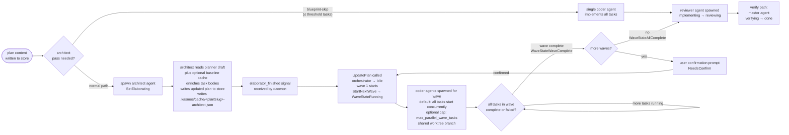

# Wave Execution Flow

This document explains how kasmos turns a planner-authored markdown plan into a
set of parallel coder agents, waits for them to finish, and then routes the
result into the review/verify pipeline.

**Related files:**
`orchestration/engine.go` · `orchestration/lifecycle_agents.go` ·
`orchestration/prompt.go` · `orchestration/cache.go` · `orchestration/meta.go` ·
`orchestration/loop/processor.go`

---

## 1. High-level lifecycle



**Blueprint-skip** is a short-circuit for very small plans (total tasks ≤
`blueprint_skip_threshold` in config). A single coder agent receives
`BuildBlueprintSkipPrompt` and implements everything sequentially, emitting
`implement-finished` when done. The architect pass and wave orchestration are
skipped entirely; the rest of the lifecycle (review → verify → done) is
identical. See `orchestration/engine.go:ShouldBlueprintSkip` and
`orchestration/prompt.go:BuildBlueprintSkipPrompt`.

By default, `[orchestration].parallel_planner_architect` is `true` and plan start
adds an advisory baseline session beside the planner:

1. plan start clears stale `.kasmos/cache/<planSlug>-architect-baseline.json`
2. the planner starts normally
3. an `architect-baseline` runtime session starts separately and writes only the
   baseline cache artifact
4. the planner writes the draft and emits the existing `planner_finished` signal
5. the final architect pass reads the planner draft plus a valid cached
   baseline; if the cache is missing, corrupt, or for a different planner input,
   it falls back to the existing inline self-baseline behavior
6. coder waves proceed normally

To restore planner-first behavior — where the planner finishes and emits
`planner_finished` before the architect pass starts — set
`[orchestration].parallel_planner_architect = false`. The architect pass then
derives its own inline baseline before merging with the planner draft.

The baseline cache is advisory. It is safe to delete, is not task-store state,
and never drives lifecycle status by itself. The baseline session emits no
lifecycle signals; signal names stay unchanged (`planner_finished`,
`elaborator_finished`, `implement_task_finished`, and the existing review/verify
signals). Blueprint-skip still runs before the final architect pass, so a small
planner draft may produce a baseline cache that is never consumed.

The final audit artifact is the architect metadata file at
`.kasmos/cache/<task>-architect.json`. Architect agents may add an optional,
schema-versioned `decision_audit` object to that file with their
baseline-vs-planner comparison and final decisions. The parallel
`.kasmos/cache/<task>-architect-baseline.json` cache is only advisory input for
that comparison; it is not the durable audit artifact.

---

## 2. Concrete two-wave example

The sequence below shows a plan with Wave 1 (tasks 1–3) and Wave 2 (tasks 4–5).

```mermaid
sequenceDiagram
    actor User
    participant D as Daemon / Processor
    participant B as Architect baseline
    participant A as Architect agent
    participant C1 as Coder W1-T1
    participant C2 as Coder W1-T2
    participant C3 as Coder W1-T3
    participant C4 as Coder W2-T4
    participant C5 as Coder W2-T5
    participant Rev as Reviewer
    participant Ver as Master/Verifier

    User->>D: implement_start signal
    Note over D: FSM to implementing, optional stale baseline cache cleared

    opt parallel_planner_architect active (default; disabled when set to false)
        D->>B: spawn architect-baseline session
        Note over B: writes .kasmos/cache/&lt;planSlug&gt;-architect-baseline.json only; emits no lifecycle signal
    end

    D->>A: spawn architect agent (BuildElaborationPrompt)
    Note over A: reads codebase, planner draft, and valid baseline cache if present; falls back inline if missing
    Note over A: enriches task bodies, assigns preferred_model per task
    A->>D: writes enriched plan to store
    A->>D: writes .kasmos/cache/&lt;planSlug&gt;-architect.json (SaveArchitectMeta)
    A->>D: elaborator_finished signal

    Note over D: ProcessElaborationSignals: UpdatePlan to WaveStateIdle, StartNextWave to WaveStateRunning, ExecutionPhase = wave_running (wave 1)

    Note over D: default: all wave tasks start concurrently; set max_parallel_wave_tasks in [resources] to cap concurrency (see §7)

    par Wave 1 — parallel coder agents (shared worktree, default: all at once)
        D->>C1: spawn W1-T1 (BuildTaskPrompt, preferred_model from architect meta)
        D->>C2: spawn W1-T2
        D->>C3: spawn W1-T3
    end

    Note over C1,C3: agents commit only their own files, never git add -A, architect meta intended to prevent overlap; conflicts can be detected and surfaced (DetectFileConflicts)

    C1->>D: implement_task_finished signal (wave=1, task=1)
    C2->>D: implement_task_finished signal (wave=1, task=2)
    C3->>D: implement_task_finished signal (wave=1, task=3)

    Note over D: MarkTaskComplete x 3, checkWaveComplete to WaveStateWaveComplete

    D->>User: wave-complete confirmation prompt (NeedsConfirm)

    User->>D: confirm → advance to wave 2

    Note over D: StartNextWave to WaveStateRunning, ExecutionPhase = wave_running (wave 2)

    par Wave 2 — parallel coder agents
        D->>C4: spawn W2-T4
        D->>C5: spawn W2-T5
    end

    C4->>D: implement_task_finished signal (wave=2, task=4)
    C5->>D: implement_task_finished signal (wave=2, task=5)

    Note over D: WaveStateAllComplete, ImplementFinished suppression lifted, FSM: implementing to reviewing

    D->>Rev: spawn reviewer agent
    Rev->>D: review_approved signal

    Note over D: FSM: reviewing to verifying, ExecutionPhase = master running

    D->>Ver: spawn master agent
    Ver->>D: verify_approved signal

    Note over D: FSM: verifying → done

    D->>User: task done · PR created
```

---

## 3. WaveOrchestrator states

| Constant              | Meaning |
|-----------------------|---------|
| `WaveStateIdle`       | Orchestrator created; no wave has started yet (also set after `UpdatePlan`) |
| `WaveStateElaborating`| Architect agent is running; `StartNextWave` is blocked until `UpdatePlan` is called |
| `WaveStateRunning`    | Current wave's coder agents are active |
| `WaveStateWaveComplete` | All tasks in the current wave resolved; awaiting user confirmation before wave N+1 |
| `WaveStateAllComplete`| Every wave is done; `implement-finished` suppression is lifted so the FSM can advance |

Source: `orchestration/engine.go:10–19`.

---

## 4. Architect metadata file

The architect agent writes `.kasmos/cache/<plan-slug>-architect.json` via
`SaveArchitectMeta(cacheDir, planSlug, meta)` (`orchestration/cache.go:17`).
This file is consumed by the orchestrator on every wave start via
`LoadArchitectMeta` so that each coder agent receives:

- **`preferred_model`** / **`fallback_model`** — routing hints for the agent
  runner (e.g. `openai/gpt-5.3-codex-spark`)
- **`files_to_modify`** — used by `DetectFileConflicts` to enforce that no two
  tasks in the same wave touch the same file
- **`verify_checks`** — injected into the coder prompt as a "Verification
  Commands" section
- **`dependency_task_numbers`** — wave-placement cross-check (inter-wave
  ordering is the planner/architect's responsibility)

The same metadata file can include optional **`decision_audit`** data. It is
schema-versioned for forward compatibility and is read by `kas serve` through
the task-store-backed architect decisions endpoint. hq shows an `architect
decisions` tab on task detail pages when that audit metadata is available; older
metadata without `decision_audit` continues to drive wave orchestration normally.

Schema (Go): `orchestration/meta.go:ArchitectMeta`, `WaveMeta`, `TaskMeta`,
`ArchitectDecisionAudit`, and `ArchitectDecisionDifference`.

Example fragment (matches this task's own metadata):

```json
{
  "plan_id": "build-architecture-graphic",
  "schema_version": 1,
  "waves": [
    {
      "wave": 2,
      "parallel": true,
      "tasks": [
        {
          "task_number": 7,
          "title": "author wave execution diagram",
          "preferred_model": "openai/gpt-5.3-codex-spark",
          "fallback_model": "openai/gpt-5.4",
          "files_to_modify": ["docs/architecture/wave-execution.md"],
          "verify_checks": [
            "rg -n 'architect|wave|waiting for confirmation|review|verify' docs/architecture/wave-execution.md"
          ]
        }
      ]
    }
  ]
}
```

---

## 5. Why same-wave tasks must be file-independent

All coder agents in a wave share **one git worktree** on the same branch.
There is no locking mechanism — agents commit freely. If two agents were
assigned overlapping files, the second commit would silently overwrite the
first agent's edits, or produce a non-fast-forward conflict that stalls the
session.

The architect pass enforces file independence before the wave runs:

1. `BuildElaborationPrompt` instructs the architect to assign each file to at
   most one task per wave.
2. `DetectFileConflicts` (`orchestration/engine.go:323`) reads the architect
   metadata and surfaces any overlapping `files_to_modify` assignments as
   `FileConflict` entries.
3. Each coder prompt includes a `CRITICAL - shared worktree rules` block
   (injected by `BuildTaskPrompt`, `orchestration/prompt.go:47–61`) that
   prohibits `git add -A`, cross-task formatters, and working around sibling
   build failures.

If the architect places two tasks that genuinely share a file into the same
wave, `DetectFileConflicts` will report the conflict and the TUI can alert the
user before spawning agents.

---

## 6. Sub-phase text while `implementing` is active

The outer FSM status stays `implementing` throughout wave execution — it does
**not** change between waves or during the architect pass. The sub-phase
(`ExecutionState.Phase`) changes independently:

| Sub-phase (`ExecutionPhase`)   | What is happening |
|-------------------------------|-------------------|
| `"architecting"`              | Architect agent is running (`SetElaborating` called) |
| `"wave_running"`              | Coder agents are active for the current wave |
| `"wave_waiting"`              | Wave complete; waiting for user confirmation |
| `"single_agent_implementing"` | Blueprint-skip path; single coder agent running |

The TUI status bar reads the sub-phase to show contextual text like
"architecting", "wave 1 running", or "waiting for confirmation" while the
outer task card remains in the `implementing` column. This is why a task can
appear to be "implementing" for a long time: the outer status is stable; only
the sub-phase text changes.

Source: `config/taskfsm/` execution phase constants; sub-phase persistence in
`orchestration/loop/processor.go:ProcessElaborationSignals` and
`ProcessWaveSignals`.

---

## 7. Limited parallelism (`max_parallel_wave_tasks`)

By default, every task in a wave is launched concurrently. Setting
`max_parallel_wave_tasks` in the `[resources]` config block caps how many coder
agents run at the same time within a single wave.

```toml
[resources]
profile = "interactive"
max_parallel_wave_tasks = 1  # one agent at a time; overrides the profile preset
```

When the limit is active:

1. **Wave start** — `StartNextWaveLimited(limit)` marks at most `limit` tasks as
   running; the remainder are left in the `pending` state. Only the running
   tasks get agent processes spawned for them.
2. **Task completes or fails** — `StartPendingTasks(limit)` is called; it
   computes available capacity as `limit − ActiveTaskCount()` and promotes
   exactly that many pending tasks to running. The daemon calls this inside
   `handleWaveTaskComplete`; the TUI calls it via `startPendingWaveTasks` after
   processing a task-signal.
3. **Wave completion** — `checkWaveComplete` only advances the wave state when
   all tasks are terminal (complete or failed). Pending tasks count as
   in-progress, so the wave stays in `WaveStateRunning` until every task has
   been launched and finished.
4. **Peer count** — each spawned batch uses `len(batch)` as its peer count, not
   the full wave size. The total wave size is still visible in the prompt header
   context.
5. **Already-running path** — when `ProcessWaveSignals` has already called
   `StartNextWave()` (marking all tasks running) before `startWaveTasks` is
   entered, `ApplyParallelismLimit(limit)` is called to move excess running
   tasks back to pending before any agents are spawned.

The `interactive` preset sets `max_parallel_wave_tasks = 1` automatically.
Setting the key to `0` (or omitting it on the `normal` profile) restores
unlimited concurrent spawning.

---

## real files

| file | role |
|------|------|
| `orchestration/engine.go` | `WaveOrchestrator`, wave states, `ShouldBlueprintSkip`, `DetectFileConflicts`; limited-parallelism helpers `StartNextWaveLimited`, `StartPendingTasks`, `ApplyParallelismLimit`, `ActiveTaskCount` |
| `orchestration/lifecycle_agents.go` | agent spec builders: `BuildArchitectAgentSpec`, `BuildReviewerAgentSpec`, `BuildFixerAgentSpec`, `BuildMasterAgentSpec` |
| `orchestration/loop/processor.go` | `ProcessElaborationSignals`, `ProcessTaskSignals`, `ProcessWaveSignals` |
| `orchestration/cache.go` | `SaveArchitectMeta`, `LoadArchitectMeta` |
| `orchestration/meta.go` | `ArchitectMeta`, `WaveMeta`, `TaskMeta` schema |
| `orchestration/prompt.go` | `BuildElaborationPrompt`, `BuildTaskPrompt`, `BuildBlueprintSkipPrompt` |

---

## see also

| page | what it adds |
|------|-------------|
| [signal-flow.md](signal-flow.md) | how `implement_task_finished` and `elaborator_finished` signals are created and claimed |
| [task-fsm.md](task-fsm.md) | how `implementing → reviewing → verifying → done` plays out after wave completion |
| [review-cycle.md](review-cycle.md) | reviewer and master agent sequence once coder wave finishes |
