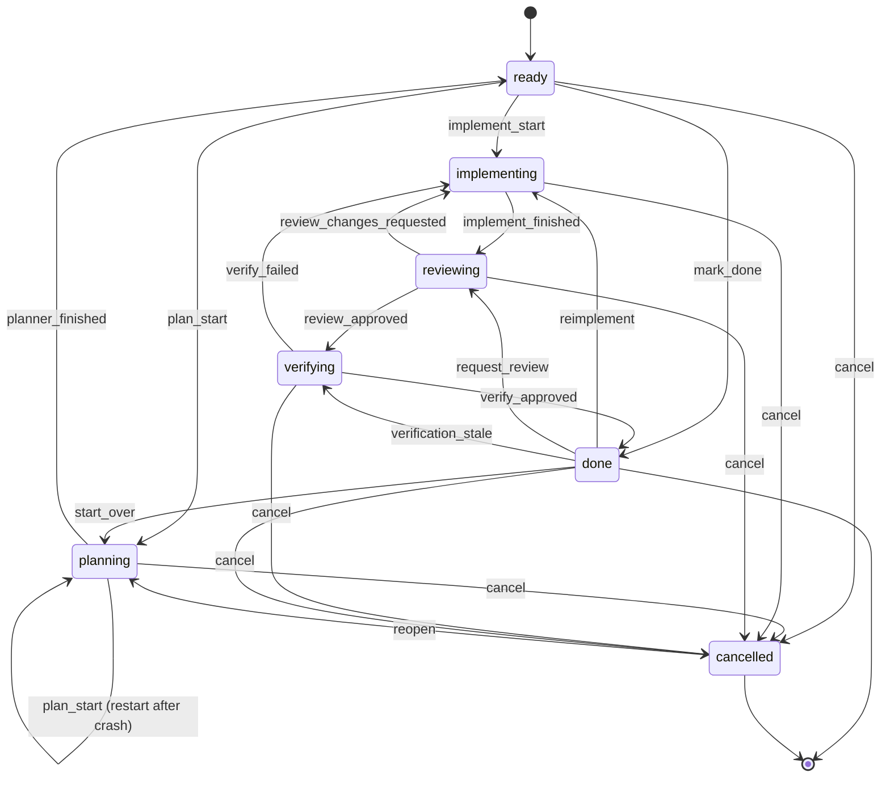

import lifecycleDiagram from "@site/static/img/kasmos-lifecycle-flow.svg";

# lifecycle

<figure className="kasmos-lifecycle-diagram">
  
</figure>

every task in kasmos moves through a finite state machine (fsm). the fsm validates all transitions, writes new status to the task store, and records phase timestamps.

## statuses

| status | meaning |
|--------|---------|
| `ready` | task is registered and waiting to start |
| `planning` | a planner agent is writing the plan content |
| `implementing` | coder agents are working on the task |
| `reviewing` | a reviewer agent is checking the implementation |
| `verifying` | a master agent is running the holistic readiness gate before `done` (only entered when `auto_readiness_review = true`); `verify_failed` always returns the task to `implementing` |
| `done` | the current branch HEAD is approved and ready to merge. `done` is revocable: a later commit reopens verification |
| `cancelled` | explicitly stopped; can be reopened |

## execution phases

while `status` is the coarse lifecycle stage, tasks in the `implementing` and adjacent states carry a finer-grained `ExecutionPhase` that records where the orchestration engine is within that stage.

| phase | meaning |
|-------|---------|
| `planned` | planner finished; task is ready to start implementation |
| `architecting` | architect agent is decomposing the plan into waves |
| `wave_running` | at least one wave of coder agents is running |
| `wave_waiting` | current wave finished; waiting for the next wave gate |
| `single_agent_implementing` | running as a single coder (no wave decomposition) |
| `fixing` | fixer/remediation agent is addressing review feedback |
| `reviewing` | reviewer agent is active |

### how phases are set

the `planner_finished` event writes `ExecutionState{Phase: "planned"}`. all other events leave the phase empty; the orchestration engine writes it directly as agent sessions advance.

agent spawn options are resolved alongside these phase actions, not stored in signal payloads. for daemon-managed lifecycle spawns, `permission_default` inherits to `SkipPermissions=true` unless the role profile explicitly says `"prompt"` or `"bypass"`; local tui spawns inherit to prompt. the repo `[resources]` block is also resolved at spawn time and forwarded as `ResourceControls`, so agents and sdk shell commands inherit the same wrapper and build-env policy. the resolved permission value and non-normal resource profile follow the instance through daemon status and live-preview records so pause/resume/restart paths do not guess.

### draft-ready vs planned-ready

a `ready` task can be in one of two substates:

- **draft-ready** — `status: ready`, `execution_phase: ""` (empty). the task has been registered but the planner has not yet finished. `implement_start` is **rejected** for draft-ready tasks — both `kas task implement` and the tui's "implement" action return an error (`"task is ready but not yet planned"`).
- **planned-ready** — `status: ready`, `execution_phase: "planned"`. the planner finished successfully and the task is safe to hand off to coder agents.

## events

events trigger transitions. some events are **user-only** (can only be fired from the tui or cli) and cannot be emitted as agent signals.

| event | user-only | description |
|-------|-----------|-------------|
| `plan_start` | no | start or restart a planner agent |
| `planner_finished` | no | legacy/manual planner completion; also applied internally after all configured planner drafts finish |
| `implement_start` | no | start coder agents |
| `implement_finished` | no | all coders signalled completion |
| `request_review` | **yes** | manually trigger a reviewer |
| `review_approved` | no | reviewer approved the implementation; routes `reviewing → verifying` when `auto_readiness_review = true`, otherwise `reviewing → done` |
| `review_changes_requested` | no | reviewer requested changes |
| `verify_approved` | no | master agent approved during verifying (→ `done`) |
| `verify_failed` | no | master agent requested changes during verifying (→ `implementing`). the verdict is fail-closed and cannot be rewritten as approval |
| `verification_stale` | no | internal drift event that reopens `done → verifying` when the verified commit no longer matches branch HEAD |
| `start_over` | **yes** | reset to planning from done |
| `reimplement` | **yes** | resume implementation from done without resetting branch |
| `mark_done` | **yes** | skip straight to `done` from `ready` when the work has been absorbed elsewhere or is obsolete |
| `cancel` | **yes** | cancel the task from any active status |
| `reopen` | **yes** | reopen a cancelled task back to planning |

> **verifying signals:** `verify_approved` and `verify_failed` are the canonical signal names emitted by the master agent. deprecated aliases are accepted at ingress and canonicalized: `readiness_approved` → `verify_approved`; `readiness_changes_requested` / `readiness-changes` / `readiness-changes-requested` / `master_approved` → `verify_failed`.

### terminal approval and pull requests

terminal approval is `verify_approved`, or `review_approved` when `auto_readiness_review = false`. After applying that transition, kasmos marks the task `done` and, when `auto_create_pr = true`, runs the shared PR creation service. The service uses the branch stored in task metadata, adopts an existing PR before attempting creation, and persists both the URL and latest attempt outcome. Successful `created` and `adopted` outcomes remain visible with their attempt count instead of being cleared; a later idempotent call records `skipped` with the existing URL. PR creation failure does not roll back the lifecycle transition; recover with `kas task pr <plan-file>`. See [automatic PR creation](../daemon/pr-creation.mdx).

> **planner drafts:** when `[orchestration].planners` is unset or empty, `plan_start` uses the legacy single-planner path and the planner emits `planner_finished`. when `[orchestration].planners = ["planner_opus", "planner_gpt"]` is set, kasmos clears stale `.kasmos/cache/<plan-file>-planner-<profile>.md` caches, spawns each listed planner in draft mode, and waits for gateway-only `planner_draft_finished` signals with `{"planner_id":"<profile>"}` payloads. the processor aggregates those draft signals and internally advances planning once all expected profiles are done. the later architect pass consumes the draft caches and records them in `decision_audit.planner_drafts`.

## state diagram

the following diagram shows all valid task status transitions:



## transition table

```
ready
  ├─ plan_start          → planning
  ├─ implement_start     → implementing
  ├─ mark_done           → done        (user-only; work absorbed elsewhere or obsolete)
  └─ cancel              → cancelled

planning
  ├─ plan_start          → planning   (restart after crash)
  ├─ planner_finished    → ready
  └─ cancel              → cancelled

implementing
  ├─ implement_finished  → reviewing
  └─ cancel              → cancelled

reviewing
  ├─ review_approved     → verifying  (when auto_readiness_review=true)
  │                      → done       (when auto_readiness_review=false)
  ├─ review_changes_requested → implementing
  └─ cancel              → cancelled

verifying
  ├─ verify_approved     → done
  ├─ verify_failed       → implementing
  └─ cancel              → cancelled

done
  ├─ start_over          → planning
  ├─ reimplement         → implementing
  ├─ request_review      → reviewing
  ├─ verification_stale  → verifying  (internal; branch HEAD drifted)
  └─ cancel              → cancelled

cancelled
  └─ reopen              → planning
```

Approval is persisted as `verified_sha`, `verified_base_sha`, `verified_at`, and `verified_by`, with `stale_verification_reason` explaining a revoked approval. New approvals use `master`, `operator`, or `auto`; older records may contain the legacy `force_promoted` value. The daemon compares `verified_sha` with live branch HEAD after approval; drift kills the stale master and applies `verification_stale` so a fresh master reviews the new commit. PR admission performs the same transition when it discovers stale proof, preventing a `done` task from remaining terminal after its verification record is cleared. Legacy pre-upgrade `done` tasks with an empty `verified_sha` are left alone by the background check, but cannot create a PR or merge until re-verified.

## phase timestamps

when the fsm writes a new status, it also records a timestamp for that phase in the task store. these power the timeline view in the tui's info pane:

| status reached | timestamp field |
|----------------|-----------------|
| `planning` | `planning_at` |
| `implementing` | `implementing_at` |
| `reviewing` | `reviewing_at` |
| `verifying` | `verifying_at` |
| `done` | `done_at` |

## triggering transitions

### from the tui

select a task and press `↵` (enter) to open the context menu. available actions depend on the current status (e.g. "start planner", "implement", "review", "cancel").

### from the cli

```bash
kas task transition <task-file> <event>
```

examples:

```bash
kas task transition my-feature plan_start
kas task transition my-feature implement_start
kas task transition my-feature cancel
kas task transition my-feature reopen
```

### from agents (signals)

agents should emit **agent signals** via mcp `signal_create`. the signal is written to the sqlite-backed signals table and picked up by the daemon, which drives fsm transitions. `kas signal emit` is the operator and cli fallback. a compatibility path also exists: signals written as files under `.kasmos/signals/` can be processed by `kas signal process`. on daemon startup, kasmos only recovers any files left in `.kasmos/signals/processing/` back to the root; file-based signals are then bridged/processed on subsequent daemon ticks. either way, the orchestration loop claims pending signals atomically before calling `Transition()` on the fsm.

operator-initiated `implement_start` transitions use the same gateway path. because the task store is already `implementing` when the row is created, the transition handler marks the payload with `{"fsm_applied":true}`; the daemon recognizes that marker and launches the architect or initial wave instead of treating the row as stale.

when an active coder wave must be recovered, `retry_wave` reconstructs that wave from the stored plan, execution state, and subtask statuses. tasks already marked complete stay complete; unresolved tasks return to running state. before those tasks are spawned again, the daemon kills the stale agents for that wave so duplicate workers cannot continue against the shared branch.

## forcing a status

for recovery when signals fail or the fsm gets stuck:

```bash
kas task set-status <task-file> <status> --force
```

this bypasses transition validation and writes directly to the store.
