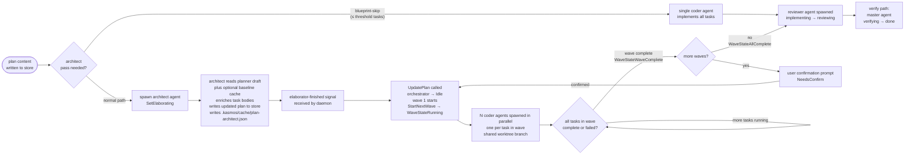

import lifecycleDiagram from "@site/static/img/kasmos-lifecycle-flow.svg";

# waves

<figure
  className="kasmos-lifecycle-diagram"
  tabIndex={0}
  aria-label="kasmos lifecycle: planner and architect baseline run in parallel, then architect merge, coder waves, review and fix loop, readiness, and done."
>
  
</figure>

Waves are the parallel execution unit in kasmos. A multi-wave plan runs wave 1 to completion, then wave 2, and so on. All tasks within a single wave run concurrently as separate agent instances on isolated git worktrees.

## wave execution flow

the following diagram shows the high-level wave execution lifecycle — from plan content through architect elaboration, parallel coder waves, and into the review/verify pipeline:



## wave orchestration states

The `orchestration.WaveOrchestrator` in `orchestration/engine.go` tracks five states:

| state | value | meaning |
|-------|-------|---------|
| `WaveStateIdle` | `0` | not started; waiting for the first `StartNextWave()` call |
| `WaveStateElaborating` | `1` | architect agent is enriching task bodies before execution begins |
| `WaveStateRunning` | `2` | current wave's tasks are running |
| `WaveStateWaveComplete` | `3` | all tasks in the current wave resolved; awaiting user confirmation to advance |
| `WaveStateAllComplete` | `4` | all waves finished |

```
Idle
 ├─ SetElaborating() ──► Elaborating
 │                        └─ UpdatePlan() ──► Idle
 └─ StartNextWave() ──► Running
                         ├─ tasks complete ──► WaveComplete (if more waves remain)
                         │                    └─ user confirms ──► Running (next wave)
                         └─ all tasks complete ──► AllComplete
```

## elaboration phase

Before wave 1 begins, kasmos optionally runs an **architect** agent to decompose the plan into coder-ready task bodies. While elaboration is in progress, the orchestrator moves to `WaveStateElaborating`. `StartNextWave()` returns `nil` in this state — no tasks are launched until `UpdatePlan()` is called with the enriched plan.

When elaboration completes, `UpdatePlan()` replaces the plan and resets the orchestrator to `WaveStateIdle` so waves can begin.

By default, `[orchestration].parallel_planner_architect` is `true` and kasmos starts an advisory baseline beside the planner:

1. plan start clears stale `.kasmos/cache/<planSlug>-architect-baseline.json`
2. the planner starts
3. an `architect-baseline` runtime session starts separately
4. the planner writes the draft and emits `planner-finished`
5. the final architect reads the planner draft plus a valid cached baseline, or falls back inline
6. coder waves proceed normally

To restore planner-first behavior — where the planner finishes before the architect pass starts — set `[orchestration].parallel_planner_architect = false`. The architect pass then derives its own baseline inline while reading the planner draft.

The baseline cache is safe to delete and is not task-store state. The baseline session writes the cache artifact only; it does not edit task content, update lifecycle status, or emit signals. Signal names are unchanged. Blueprint skip can still skip the final architect pass for small planner drafts, so a baseline cache may be produced but unused.

The final architect metadata is written to `.kasmos/cache/<task>-architect.json`. That file may include an optional, schema-versioned `decision_audit` object with the architect's baseline-vs-planner comparison and final decision. The parallel `.kasmos/cache/<task>-architect-baseline.json` file is advisory input only, not the final audit artifact. hq shows an `architect decisions` tab on task detail pages when audit metadata is available.

## wave confirmation

When a wave completes, kasmos shows a confirmation dialog before advancing to the next wave. This gives you a chance to review what was done and abort if something went wrong. `NeedsConfirm()` returns `true` once per completion — calling it marks the dialog as shown. If you cancel, `ResetConfirm()` re-arms the latch so the dialog reappears.

## blueprint skip (single-agent mode)

For small tasks, wave orchestration adds unnecessary overhead. `ShouldBlueprintSkip` in `orchestration/engine.go` returns `true` when the total number of tasks across all waves is at or below the configured threshold:

```go
func ShouldBlueprintSkip(plan *taskparser.Plan, threshold int) bool {
    if plan == nil || threshold <= 0 {
        return false
    }
    total := 0
    for _, wave := range plan.Waves {
        total += len(wave.Tasks)
    }
    return total <= threshold
}
```

Configure this in `.kasmos/config.toml`:

```toml
[orchestration]
blueprint_skip_threshold = 2
```

When blueprint skip is active, the task goes directly to a single coder agent — no elaboration, no wave confirmation dialogs.

## task statuses within a wave

Each task in a wave tracks its own state:

| state | meaning |
|-------|---------|
| `taskPending` | allocated but not yet started |
| `taskRunning` | agent is executing |
| `taskComplete` | agent finished successfully |
| `taskFailed` | agent exited with an error |

Failed tasks do not block the wave from completing — other tasks continue. Once all tasks in a wave have resolved (either complete or failed), the wave transitions to `WaveStateWaveComplete`. You can retry failed tasks with `RetryFailedTasks()`.

## subtask persistence

Task states within a wave are persisted to the task store via `store.UpdateSubtaskStatus`, so the TUI can display accurate per-task status even after a restart. The orchestrator is restored via `RestoreToWave()`, which fast-forwards to the target wave and re-applies saved task states.

## file conflict detection

The architect agent produces metadata that lists which files each task intends to modify. `DetectFileConflicts()` checks for files claimed by multiple tasks in the same wave and surfaces them as warnings in the TUI, helping you spot potential merge conflicts before they happen.
