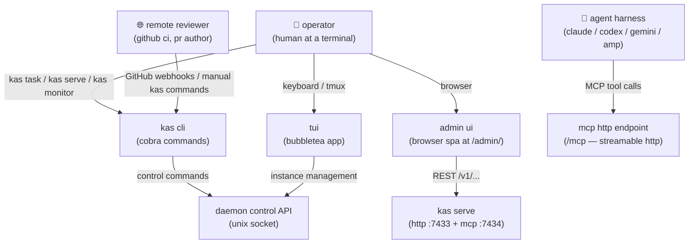

# architecture overview

kasmos is a go application with several surfaces that work together: an interactive terminal ui, a cobra cli, a background daemon, a sqlite/http task store, and a web front-end.

## high-level directory map

| path | what lives here |
|------|----------------|
| `cmd/kas/` | app entrypoint, cobra root wiring, tui startup, `setup` / `reset` / `debug` / `version` |
| `cmd/kas/check.go` | `kas check` — audits skill sync across agent harnesses |
| `cmd/` | cli subcommands: `task`, `daemon`, `monitor`, `signal`, `tmux`, `instance`, `audit`, `serve` |
| `app/` | main bubble tea model, tui state machine, orchestration glue |
| `ui/` | rendering components: nav, status bar, info pane, overlays |
| `session/` | instance lifecycle, execution backends (tmux / sdk), notifications, git worktrees |
| `session/git/` | worktree checkout, resume, orphan adoption |
| `session/tmux/` | tmux session/window/pane management |
| `session/sdk/` | sdk app-server execution backend (claude + codex transports, renderer) |
| `orchestration/` | prompt builders, wave/task orchestration |
| `orchestration/loop/` | signal gateway scanner, wave driver loop |
| `config/` | TOML/JSON config loading, task parser, FSM, state, store |
| `config/taskparser/` | markdown plan parser |
| `config/taskfsm/` | task lifecycle finite state machine |
| `config/taskstate/` | in-process task state wrapper |
| `config/taskstore/` | sqlite + http task store and signal gateway |
| `daemon/` | multi-repo background orchestrator, unix-socket control api |
| `internal/initcmd/` | `kas setup` wizard and scaffold templates |
| `web/` | Next.js App Router marketing site |
| `web/docs/` | Docusaurus docs site (this site) |
| `web/admin/` | vite-based spa for the task store browser ui |
| `.agents/`, `.claude/`, `.opencode/` | scaffolded agent harness configs and skills |
| `contrib/` | systemd service files for daemon and task-store deployment |

## request flow

here is how a typical action flows through the system from the user's perspective:

```
tui / cli action
      │
      ▼
  task store / FSM
  (config/taskstore, config/taskfsm)
      │  status transition recorded in sqlite
      ▼
  agent session
  (session/ + session/tmux/ or session/sdk/)
      │  spawns agent in tmux pane or sdk app-server process
      ▼
  agent emits signal
  (mcp `signal_create` ... — db gateway, preferred)
  │  compatibility: filesystem sentinel in .kasmos/signals/ bridged on next tick
      │
      ▼
  signal gateway scanner
  (orchestration/loop/gateway_scanner.go)
      │  claims signal atomically, marks "processing"
      ▼
  orchestrator / daemon
  (orchestration/ + daemon/)
      │  drives next lifecycle stage (next wave, reviewer, etc.)
      ▼
  next lifecycle stage
  (another task transition, another session launch, or done)
```

### key notes on the flow

- **signals** use a db-backed gateway as the primary path — agents should use mcp `signal_create`, while `kas signal emit` is the operator and cli fallback. both write rows to the global `~/.config/kasmos/taskstore.db`. the daemon bridges repo-local `.kasmos/signals/` sentinel files into the db on each tick; this filesystem path is compatibility plumbing, not the recommended workflow for new agents.
- **worktrees**: each agent works in an isolated `git worktree` under `<repo-root>/.worktrees/`. the main repo root is always resolved by `config.ResolveRepoRoot()` even when running inside a worktree.
- **config is anchored to the main repo root**: `.kasmos/` always lives at the top-level repo, never inside a worktree.
- **topic collision gate**: only one task per topic can be `implementing` at a time. the store enforces this before spawning a coder session.

## subsystem details

### tui (bubble tea / lip gloss)

the interactive app is built with [bubble tea v2](https://github.com/charmbracelet/bubbletea) and [lip gloss v2](https://github.com/charmbracelet/lipgloss). the `app/` package holds the root model and state machine; `ui/` holds individual rendering components (nav, status bar, tabs, overlays).

key conventions:
- all blocking I/O happens inside `tea.Cmd` goroutines and results are returned as `tea.Msg` — never block in `Update`.
- overlays use arrow-key navigation (`↑`/`↓`), not `j`/`k`.
- user-visible labels are lowercase.

### task store

the task store (`config/taskstore/`) is backed by sqlite via `modernc.org/sqlite` and also exposes an http api (`kas serve`). it stores task content, lifecycle status, signals, and metadata. the admin spa (`web/admin/`) talks to this http api.

the default store is the shared global database at `~/.config/kasmos/taskstore.db`. file paths inside the store have `.md` suffixes stripped (there is a migration for older records).

### scaffold-managed files

`kas setup` scaffolds agent harness configuration from templates in `internal/initcmd/scaffold/templates/` into three locations:

- `.agents/` — generic agent config and shared skills
- `.claude/` — Claude Code harness config (agents, settings, skills)
- `.opencode/` — opencode harness config (agents, skills)

if you edit the templates, you must also update the live copies (or vice-versa), then run `kas check -v` to confirm they are in sync.

### web surfaces

| surface | framework | output | path |
|---------|-----------|--------|------|
| marketing site | Next.js App Router | `web/out/` | `/kasmos` |
| docs site | Docusaurus | `web/docs/build/` | `/kasmos/docs` |
| admin spa | vite | `web/admin/dist/` | served by `kas serve` |

the marketing site and docs site both use `output: "export"` with `basePath: "/kasmos"` for static github pages deployment. the admin spa is a separate vite app that is not exported to pages — it runs as a dev tool or embedded in the daemon server.

## the `kas` command

the binary artifact is named `kas` — `go build -o kas ./cmd/kas`, `go install github.com/kastheco/kasmos/cmd/kas@latest`, and `just install` all produce or install a `kas` binary directly. `just install` also creates an optional `kms` short alias in `$GOPATH/bin`. the cli surface is always referred to as `kas` in documentation and code.

current top-level subcommands: `setup`, `check`, `task`, `serve`, `instance`, `audit`, `tmux`, `signal`, `daemon`, `monitor`, `reset`, `debug`, `version`.

## architecture diagrams

the full architecture documentation lives in `docs/architecture/` and contains detailed mermaid diagrams covering every major subsystem. key starting points:

- **system-context** — actors, surfaces, and runtime containers
- **source-of-truth** — where each piece of state lives and which process owns it
- **daemon-topology** — process internals, unix socket, sse events
- **signal-flow** — how agent signals cross service boundaries into the daemon loop
- **task-fsm** — the complete task lifecycle state machine
- **wave-execution** — how plans become parallel coder agents
- **review-cycle** — reviewer, fixer, and master agent sequence

the following diagram shows the top-level system context — who talks to kasmos, and through which surface:



see the individual docs pages for deeper dives: [lifecycle](../concepts/lifecycle.mdx) covers the task FSM, [waves](../concepts/waves.mdx) covers wave orchestration, [signals](../daemon/signals.mdx) covers the signal gateway, and [daemon architecture](../daemon/architecture.mdx) covers the daemon internals.
