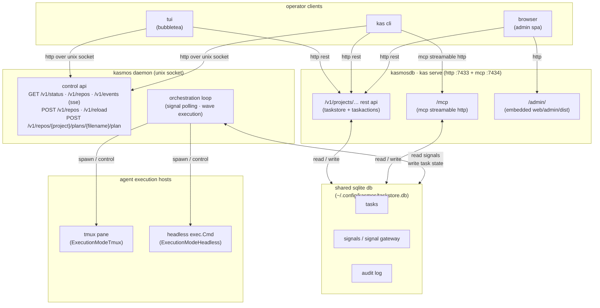

# architecture

the daemon is composed of a small set of types with well-defined responsibilities. understanding them makes it easier to debug signal flow, extend the daemon, or read the source.

## process topology

the following diagram shows how the two services (`kasmosdb` and `kasmos`), operator clients, the shared sqlite store, and agent execution hosts are connected:



## core types

### `Daemon`

defined in `daemon/daemon.go`. the top-level struct that owns everything:

| field | type | role |
|-------|------|------|
| `cfg` | `*DaemonConfig` | poll interval, repo list, auto-advance flags, socket path |
| `repos` | `*RepoManager` | thread-safe list of registered repositories |
| `spawner` | `*TmuxSpawner` | creates and tracks tmux sessions for each agent role |
| `broadcaster` | `*api.EventBroadcaster` | fan-out sse event stream served by the control socket |
| `prMonitor` | `*PRMonitor` | optional goroutine that polls GitHub PRs for review comments |
| `pidLock` | `*PIDLock` | advisory lock (`<socket>.pid`) preventing duplicate daemon processes |

the `Daemon.Run(ctx)` call is the blocking entry point. it acquires the pid lock, opens the unix socket, starts the http control server, and then enters the select loop.

### `RepoManager`

defined in `daemon/repo.go`. a `sync.RWMutex`-protected slice of `RepoEntry` values. repos are added with `Add(path)` and removed with `Remove(path)` or `RemoveByProject(project)`. all mutations are safe to call from the control api goroutine while the poll loop runs.

### `RepoEntry`

each registered repo is represented as a `RepoEntry`:

| field | type | role |
|-------|------|------|
| `Path` | `string` | absolute filesystem path |
| `Project` | `string` | `filepath.Base(path)` — the repo's canonical name; used as the namespace key inside the shared DB |
| `Store` | `taskstore.Store` | handle into the **shared global** task store (`~/.config/kasmos/taskstore.db`), scoped to this repo's `project` name (may be nil if the DB could not be opened) |
| `SignalGateway` | `taskstore.SignalGateway` | handle into the **shared global** signal gateway (same DB, same open call) — reused across all registered repos (may be nil) |
| `SignalsDir` | `string` | `<path>/.kasmos/signals/` — repo-local filesystem directory; still scanned by `BridgeFilesystemSignals` for backward compatibility |
| `Processor` | `*loop.Processor` | per-repo signal processor that persists wave orchestrator state between ticks |

the `Processor` is created once per `Add` call and reused on every tick. this keeps `WaveOrchestrator` state alive across poll cycles without re-reading from disk.

### `loop.Processor`

defined in `orchestration/loop/`. receives scanned signals and returns typed `Action` values:

- `SpawnCoderAction`, `SpawnReviewerAction`, `SpawnFixerAction`, `SpawnElaboratorAction`
- `AdvanceWaveAction`, `TaskCompleteAction`
- `TransitionAction`, `ReviewApprovedAction`, `ReviewCycleLimitAction`
- `PausePlanAgentAction`, `CreatePRAction`

the processor is stateful — it holds a `WaveOrchestrator` per active plan so that inter-tick wave state is not lost.

### `TmuxSpawner`

defined in `daemon/spawner.go`. creates named tmux sessions for each agent role using a consistent naming convention (`<plan-name>-<role>`). tracks running instances in memory so the daemon can monitor prompt state, detect completion, and kill agents when needed.

key methods:

- `SpawnCoder`, `SpawnReviewer`, `SpawnFixer`, `SpawnElaborator`, `SpawnPlanner` — create sessions
- `SpawnWaveTask` — creates a coder session with wave/peer-count metadata injected into the prompt
- `KillAgent(repoPath, planFile, agentType)` — sends SIGTERM to the named session
- `KillWaveAgents(repoPath, planFile, wave)` — kills all coder sessions for a completed wave
- `RunningInstances()` / `InstancesForRepo(path)` — read current tracking state
- `DiscoverOrphanSessions()` — lists `kas_*` tmux sessions not tracked by this spawner (used during recovery)
- `RestoreTrackedInstance(…)` — re-adopts an orphan session into the tracking map
- `DrainAll(ctx)` — waits for all running sessions to exit before shutdown

### `api.EventBroadcaster`

defined in `daemon/api/`. maintains a fan-out channel to all active sse connections on the control socket. the daemon calls `broadcaster.Emit(event)` after every significant action. clients streaming `GET /v1/events` receive these events in real time. `Close()` signals eof to all subscribers when the daemon shuts down.

### `PRMonitor`

defined in `daemon/pr_monitor.go`. runs as a separate goroutine started by `Daemon.Run` when `cfg.PRMonitor.Enabled` is true. polls open PRs at `cfg.PRMonitor.PollInterval` (default 60 s) and dispatches fixer agents for unprocessed `CHANGES_REQUESTED` or `COMMENTED` reviews from non-bot users.

## the event loop

`Daemon.Run` after setup:

```
ticker := time.NewTicker(cfg.PollInterval)   // default 2 s

for {
    select {
    case <-ctx.Done():
        drain → shutdown http → release lock → close broadcaster → return

    case <-ticker.C:
        for each RepoEntry:
            tickRepo(ctx, entry)
    }
}
```

`tickRepo` chooses between two signal processing paths depending on gateway availability:

**db-backed path** (primary — when `entry.SignalGateway != nil`):
1. `loop.BridgeFilesystemSignals` — scans `<repo>/.kasmos/signals/` and all shared worktrees under `<repo>/.worktrees/`; inserts any new filesystem sentinel files as `pending` rows in the shared `signals` table. this is a compatibility bridge — for agents, the canonical way to emit signals is mcp `signal_create`; `kas signal emit` is the operator and cli fallback.
2. `gateway.Claim(project, workerID)` — atomically transitions one `pending` row to `processing` and returns it.
3. `loop.ConvertSignalEntry(entry, &scan)` — decodes the DB row into a typed `ScanResult`.
4. `processor.Tick(scan)` → `[]Action` — feeds the scan to the processor.
5. `executeAction(ctx, entry, action)` for each action.
6. `gateway.MarkProcessed(id, status, result)` — marks the row `done` or `failed`.
7. repeat from step 2 until no pending signals remain for this repo's project.

**legacy filesystem path** (fallback — when `SignalGateway` is nil, e.g. shared db unavailable):
- Reads signals directly from `staging/`, `processing/`, and `failed/` subdirs under `<repo>/.kasmos/signals/`.
- Each signal is moved to `processing/` before handling, then deleted (`CompleteProcessing`) or dead-lettered to `failed/` (`FailProcessing`).
- This path exists so the daemon degrades gracefully; it is not the recommended signal API.

## reaper goroutine

a secondary goroutine runs every 30 seconds and calls `gateway.ResetStuck(60s)` across all registered repos. signals that have been in the `processing` status for more than 60 seconds are reset to `pending` so a new daemon instance (or the next tick) can reclaim them. this guards against crashes between claim and mark-processed.

## session monitoring

after processing signals for a repo, the daemon calls `monitorRunningInstances`. this method:

1. calls `spawner.InstancesForRepo(path)` to enumerate tracked sessions.
2. calls `inst.CollectMetadata()` to capture the current tmux pane content.
3. detects completion (prompt visible and no pending work, or tmux session gone).
4. calls `autoAdvanceCompletedImplementer` — pushes the branch and transitions the fsm to `reviewing` automatically.
5. kills the completed implementer session and spawns a reviewer.

## shutdown sequence

when `ctx` is cancelled (SIGTERM/SIGINT):

1. `spawner.DrainAll(ctx)` — waits up to 35 seconds for all tracked sessions to exit naturally.
2. `srv.Shutdown(context.Background())` — closes the control socket; in-flight http requests finish.
3. `wg.Wait()` — waits for the reaper and pr monitor goroutines.
4. `pidLock.Release()` — removes the pid lock file.
5. `broadcaster.Close()` — sends eof to all sse subscribers.
