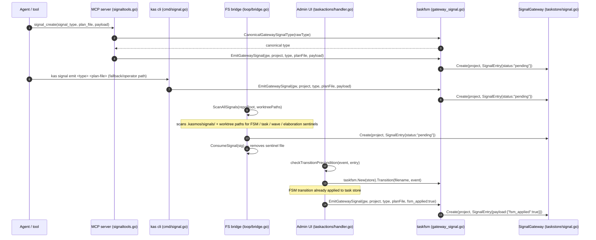

# signals

signals are the messaging layer between agent processes and the daemon. an agent (planner, coder, reviewer, etc.) emits a signal when it completes a lifecycle phase; the daemon picks it up and drives the next fsm transition.

the **primary signal path is the db-backed gateway** — signals are rows in the `signals` sqlite table in the shared global store at `~/.config/kasmos/taskstore.db`. this path is atomic, auditable, and safely concurrent. a secondary **filesystem path** exists for compatibility and is automatically bridged into the db on every daemon tick.

> **prefer mcp `signal_create` for agents and `kas signal emit` for operators over writing sentinel files directly.** both routes go through the db gateway, giving you audit history, stuck-signal recovery, and proper error messages.

signals do not carry permission or resource-control policy. when a signal produces a spawn action, the daemon resolves the target role's permission profile and repo `[resources]` profile at dispatch time, then puts the final `SkipPermissions` and `ResourceControls` values into `loop.SpawnOpts`. this keeps old signal payloads compatible while allowing repo config to choose prompt/bypass behavior per role and opt into the interactive resource profile without changing signal payloads.

```sh
# emit a signal (db gateway path — cli/operator fallback)
kas signal emit implement_finished my-plan
kas signal emit implement_task_finished my-plan --payload '{"wave_number":2,"task_number":3}'
```

## signal flow diagrams

the following diagram shows the four independent ingress paths that create a pending signal row in the gateway:



the following diagram shows the daemon consumption path — how pending signals are claimed and processed on each tick:

```mermaid
sequenceDiagram
    autonumber
    participant Daemon as Daemon tick (daemon/daemon.go)
    participant Bridge as BridgeFilesystemSignals (loop/bridge.go)
    participant GW as SignalGateway
    participant Convert as ConvertSignalEntry (loop/gateway_scanner.go)
    participant Proc as Processor.Tick (loop/processor.go)
    participant FSM as ProcessFSMSignals
    participant Task as ProcessTaskSignals
    participant Wave as ProcessWaveSignals
    participant Exec as executeAction
    participant Store as TaskStore / Agent spawner

    Daemon->>Bridge: BridgeFilesystemSignals(gw, project, repoRoot, worktreePaths)
    Bridge-->>GW: Create rows for any sentinel files found, then removes them

    loop for each pending signal
        Daemon->>GW: Claim(project, workerID) → SignalEntry
        GW-->>Daemon: entry (status → "processing")

        Daemon->>Convert: ConvertSignalEntry(entry, &scan)
        Note over Convert: elaborator_finished → architect_finished
        Convert-->>Daemon: populated ScanResult

        Daemon->>Proc: Processor.Tick(scan)
        Proc->>FSM: ProcessFSMSignals(scan.FSMSignals)
        Note over FSM: if sig.PreApplied and task already in target state, skip FSM, emit downstream actions only
        FSM-->>Proc: []Action
        Proc->>Task: ProcessTaskSignals(scan.TaskSignals)
        Task-->>Proc: []Action (TaskCompleteAction)
        Proc->>Wave: ProcessWaveSignals(scan.WaveSignals)
        Wave-->>Proc: []Action (AdvanceWaveAction)
        Proc->>Wave: ProcessRetryWaveSignals(scan.RetryWaveSignals)
        Note over Wave: rebuild active wave from persisted state; preserve completed tasks
        Wave-->>Proc: []Action (RetryWaveAction)
        Proc-->>Daemon: combined []Action

        alt actions produced
            loop for each action
                Daemon->>Exec: executeAction(ctx, repoEntry, action)
                Exec->>Store: spawn agent / transition fsm / create pr / …
            end
            Daemon->>GW: MarkProcessed(id, "done", "")
        else no actions (noop)
            Daemon->>GW: MarkProcessed(id, "done"/"failed", reason)
        end
    end
```

## db-backed gateway (primary path)

the db-backed signal gateway is implemented in `config/taskstore/signal_sqlite.go`. signals are rows in the `signals` sqlite table in the shared global store at `~/.config/kasmos/taskstore.db`.

### schema

```sql
CREATE TABLE IF NOT EXISTS signals (
    id           INTEGER PRIMARY KEY,
    project      TEXT    NOT NULL DEFAULT '',
    plan_file    TEXT    NOT NULL DEFAULT '',
    signal_type  TEXT    NOT NULL DEFAULT '',
    payload      TEXT    NOT NULL DEFAULT '',
    status       TEXT    NOT NULL DEFAULT 'pending',
    created_at   TEXT    NOT NULL DEFAULT '',
    claimed_by   TEXT    NOT NULL DEFAULT '',
    claimed_at   TEXT    NOT NULL DEFAULT '',
    processed_at TEXT    NOT NULL DEFAULT '',
    result       TEXT    NOT NULL DEFAULT ''
);
```

an index on `(project, status, created_at, id)` ensures efficient ordered claim queries.

### signal statuses

| status | meaning |
|--------|---------|
| `pending` | created, waiting to be claimed |
| `processing` | claimed by a daemon worker, being dispatched |
| `done` | successfully processed |
| `failed` | processing failed or signal was rejected |

### lifecycle of a DB signal

```
pending
  └─ Claim(project, workerID) ──► processing
                                    ├─ success ──► done
                                    └─ error   ──► failed
```

the `Claim` operation is a serializable transaction: it updates the row to `processing` in a single `UPDATE … WHERE id = (SELECT … LIMIT 1)` and then re-fetches the claimed row. concurrent daemon instances or restarted processes cannot claim the same signal twice.

### signal types

| signal type | emitted by | triggers |
|-------------|------------|---------|
| `implement_finished` | coder / fixer | FSM transition → `reviewing`, spawn reviewer |
| `implement_task_finished` | wave task agent | wave task complete, possible wave advance |
| `retry_wave` | operator recovery | kill stale agents for the persisted active wave, then spawn only unresolved tasks; completed tasks remain complete |
| `implement_wave` | daemon / tui | start next wave |
| `elaborator_finished` | architect | update plan content, begin wave 1 |
| `review_approved` | reviewer | FSM transition `reviewing → verifying` (spawn master agent) when `auto_readiness_review = true`; otherwise `reviewing → done` |
| `review_changes_requested` | reviewer | FSM transition → `implementing`, spawn fixer |
| `planner_finished` | planner | legacy/manual FSM transition → `ready` |
| `planner_draft_finished` | draft-mode planner | gateway-only planner draft aggregation; payload must be `{"planner_id":"<profile>"}` |
| `verify_approved` | master agent / operator | FSM transition `verifying → done`. Master payloads carry `reviewed_sha`; operator recovery carries `origin`. **No loop-cap signal is ever written to the gateway.** |
| `verify_failed` | master agent | FSM transition `verifying → implementing`, spawn fixer. when `readiness_max_verify_cycles` is reached, the processor consumes the `verify_failed` signal but applies the `verifying → done` transition instead — no new `verify_approved` signal row is created, and the original `verify_failed` row is still marked processed. callers distinguish the in-memory force-promotion via the `ForcePromoted` flag on the emitted `VerifyApprovedAction`. |

> **architect completion:** the canonical internal event is `architect_finished`, but the persisted gateway signal wire name is `elaborator_finished` (a legacy alias preserved for compatibility). `kas signal emit architect_finished` is accepted and normalized to `elaborator_finished` transparently.

> **planner drafts:** when `[orchestration].planners` is unset or empty, planning uses the legacy single-planner `planner_finished` signal. when the planner list is set, `plan_start` clears stale planner draft caches, spawns each listed profile in draft mode, and waits for `planner_draft_finished` gateway rows. the processor aggregates those rows and internally applies the planning completion transition once all configured profiles have reported.

> **manual implementation start:** a task transition to `implement_start` writes a gateway row with `{"fsm_applied":true}` after the task store already records `implementing`. the processor recognizes that pre-applied state and still dispatches the architect or first implementation wave, rather than dropping the signal as stale.

> **deprecated aliases:** `readiness_approved` → `verify_approved`; `readiness_changes_requested` / `readiness-changes` / `readiness-changes-requested` / `master_approved` → `verify_failed`. these aliases are accepted at ingress and canonicalized — use `verify_approved` / `verify_failed` in new automation.

Terminal approval can enqueue the daemon's automatic PR action. PR creation and bounded retries are tracked on the task record rather than as additional gateway signals, so replaying the approval signal is not required. The retry sweeper runs whenever `[pr_creator].enabled = true`; each repository's resolved `auto_create_pr` value decides whether that repository is scanned. Successful `created` and `adopted` outcomes remain persisted with their attempt counts.

### verification approval admission

Master approval is strict: a `verify_approved` payload must include `reviewed_sha`, and it is admitted only when that SHA still equals the branch's live HEAD. A mismatch rejects approval and keeps verification active. Operator and internal override paths carry an `origin` instead: `operator`, `force_promoted`, or `auto`. These paths bind approval to live HEAD at admission time. The task records `verified_by` as `master`, `operator`, `force_promoted`, or `auto`.

```json
{"reviewed_sha":"<full-head-sha>"}
{"origin":"operator"}
```

Wave-processing outcomes are also emitted to the audit log and daemon event stream with structured detail. Successful all-complete waves report a success outcome, while blocked or failed waves report the blocking cause and any retry-generation metadata needed by operators.

### writing a db signal

```sh
kas signal emit implement_task_finished my-plan --payload '{"wave_number":2,"task_number":3}'
```

this calls `gateway.Create(project, entry)` which inserts a row with `status = 'pending'`. in agent workflows, use mcp `signal_create` for the same gateway-backed result without shelling out to the cli. draft-mode planners should use `planner_draft_finished` with a payload such as `{"planner_id":"planner_gpt"}`; that signal is gateway-only and is not bridged through filesystem sentinels.

### stuck signal reaper

the daemon runs a reaper goroutine every 30 seconds. it calls `gateway.ResetStuck(60s)` to find signals that have been in `processing` for more than 60 seconds and reset them to `pending`. this handles daemon crashes between claim and mark-processed.

## bridging the two paths

on each tick, `loop.BridgeFilesystemSignals` scans the repo's filesystem signals directory (and all shared worktrees under `.worktrees/`) and inserts any signal files it finds as `pending` rows in the db. the filesystem files are then consumed (deleted) by the bridge so they are not re-inserted on the next tick.

this means agents can write to the filesystem path without knowing whether a gateway is present — the daemon transparently upgrades them to the db-backed flow when a gateway is available.

## filesystem path (compatibility / legacy)

the filesystem path is preserved for backward compatibility and for low-level debugging. agents that cannot reach the daemon directly may still write signal files; the bridge ensures they enter the db-backed flow on the next tick.

the filesystem path is implemented in `config/taskfsm/signalfs.go`. signals are plain files written atomically to the repo's signals directory.

### directory layout

```
<repo>/.kasmos/signals/
├── staging/           # atomic write staging area
├── processing/        # signals currently being processed by the daemon
├── failed/            # dead-lettered signals
│   └── *.reason       # companion file with ISO-8601 timestamp + failure reason
└── <signal-file>      # pending signals ready for pickup
```

- **`staging/`** — agents write here first, then atomically rename to the parent dir via `AtomicWrite`. this prevents the daemon from picking up a partially written file.
- **`processing/`** — the daemon moves a file here via `BeginProcessing` before dispatching. if the daemon crashes between pick-up and completion, the file stays in `processing/`.
- **`failed/`** — `FailProcessing` moves rejected signals here and writes a `.reason` file. inspect these to debug signal routing failures.

### startup recovery

on daemon startup, before the first poll tick, `taskfsm.RecoverInFlight(signalsDir)` scans `processing/` and moves any leftover files back to the signals root so they can be re-dispatched. if a newer signal with the same name already exists in the root (written after the crash), the stale in-flight copy is discarded to avoid overwriting newer state.

## inspecting signals

```sh
# list pending filesystem sentinel files in .kasmos/signals/ (compatibility path only)
kas signal list

# emit a db-backed signal (primary path — daemon processes these automatically)
kas signal emit implement_finished my-plan
```

failed filesystem signals accumulate in `.kasmos/signals/failed/`. examine the companion `.reason` files to understand why a signal was rejected, fix the root cause, and re-emit.
