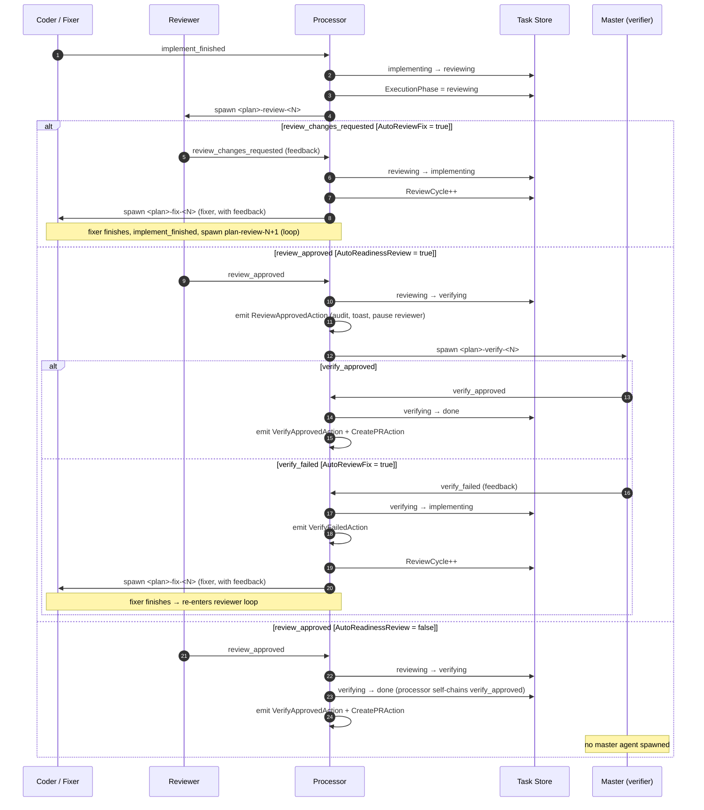

# reviewing and merging

After implementation finishes, kasmos transitions the plan to `reviewing` and spawns a reviewer agent to check the implementation before it is merged.

## review cycle diagram

the following diagram traces the full review cycle — from coder/fixer completion through reviewer verdict, optional master-agent verification, and the fix loop when changes are requested:



## the review transition

When all coder agents signal completion, the orchestration loop fires the `implement_finished` event:

```
implementing  ──► implement_finished ──►  reviewing
```

kasmos then:
1. pauses the coder instance (sets `ImplementationComplete = true`)
2. spawns a reviewer agent on the same implementation branch (via a shared worktree)
3. shows a toast: `implementation complete → review started for <plan>`

The reviewer agent runs in a tmux session by default (reviewer sessions always use tmux for visibility). It reads the plan content and compares it against the implementation on the branch.

## manual review trigger

There are two distinct ways to trigger a review manually, and they work differently.

### TUI: start review (from context menu)

Open the context menu (`↵` on the plan header) → **start review**.

This action is available from several statuses — `planning`, `ready` (when planned), `implementing`, and `reviewing`. It calls `fsmSetReviewing`, which walks the FSM forward through intermediate states (planning → implementing → reviewing) as needed before spawning a fresh reviewer. It does **not** require the task to be in `done` first; it drives the task to `reviewing` from wherever it currently is.

### CLI: request_review (done → reviewing retrigger)

```bash
kas task transition <task-file> request_review
```

This is a narrower FSM transition: it is only valid when the task is already in the `done` state. It moves `done → reviewing` and spawns a reviewer — useful to re-review a branch that was marked done but not yet merged. In the TUI this action appears in the context menu as **request review** only when the task is in `done`.

## reviewer outcomes

The reviewer agent emits one of two signals when it finishes:

| signal | transition | result |
|--------|-----------|--------|
| `review_approved` | `reviewing → verifying` (or `→ done` when `auto_readiness_review = false`) | master agent spawned (or plan marked done directly) |
| `review_changes_requested` | `reviewing → implementing` | feedback is stored; a fixer agent is spawned |

### approval path

When the reviewer approves:

- **`auto_readiness_review = true` (default):** the task transitions to the `verifying` status and kasmos spawns the **master agent** on the same worktree. A toast is shown: `review approved → verification started for <plan>`.
- **`auto_readiness_review = false`:** `review_approved` flows directly to `done` — no master agent is spawned.

The master agent applies a **materiality triage** before signaling:

The master is an independent readiness reviewer. It resolves the merge base and HEAD, inspects the complete `base..head` diff, and runs its own verification. Prior reviewer conclusions and evidence are unverified claims, not evidence the master may reuse. If a self-fix creates a commit, the master resolves HEAD again and reports that final SHA.

- **Trivial findings** (typos, format fixes, missing doc comments, unused imports — total ≤ `readiness_self_fix_max_lines` net lines): the master self-fixes directly in the worktree, verifies with `gofmt`, `go vet`, `go build`, `go test`, and `typos`, commits as `fix: <description> (master self-fix)`, and emits `verify_approved`.
- **Material issues** (logic errors, missing spec coverage, substantial rework): the master emits `verify_failed` with a structured review summary in the payload.

When it finishes, it emits one of the verifying signals:

| signal | transition | result |
|--------|-----------|--------|
| `verify_approved` | `verifying → done` | plan is marked done; PR/merge become available |
| `verify_failed` | `verifying → implementing` | feedback is stored; a fixer agent is spawned |

**Emit these with the MCP tool** (preferred):
```json
{"signal_type": "verify_approved", "plan_file": "<plan>", "project": "<project>", "payload": "{\"reviewed_sha\":\"<full-head-sha>\",\"reviewed_base_sha\":\"<default-branch-sha>\"}"}
```
or with the CLI:
```bash
kas signal emit verify_approved <plan> --payload '{"reviewed_sha":"<full-head-sha>","reviewed_base_sha":"<default-branch-sha>"}'
kas signal emit verify_failed <plan>
```

> **Deprecated aliases:** `readiness_approved` and `readiness_changes_requested` (and their hyphenated variants) are still accepted and canonicalized to `verify_approved` / `verify_failed` at ingress. Use the canonical names in new automation.

#### fail-closed verification

When the master agent emits `verify_failed`, the daemon always returns the task to `implementing`; cycle count never turns a failed verdict into approval. Use `max_review_fix_cycles` to stop automatic fixer loops after a configured number of attempts. At that limit, the task waits for operator recovery.

After verification (or when `auto_readiness_review = false` skips it), the processor checks whether the task is eligible for automatic PR creation: if the task has a branch and no PR URL is already recorded, it emits a `CreatePRAction`. The daemon picks this up and calls the GitHub PR creation flow — no config knob is needed; the behavior is automatic when the eligibility criteria are met.

If you want to create a PR manually (or the automatic path was skipped for any reason):
- press `P` with the plan or instance selected
- open the context menu → **create pr**
- `kas task pr <task-file>` from the CLI

kasmos builds the PR title and body from the plan's goal, architecture, tech stack, git diff stats, and reviewer summary.

PR creation first checks that `verified_sha` exists and still equals live branch HEAD. A mismatch records why approval became stale, kills the stale master, transitions `done → verifying`, and spawns a fresh master instead of creating a PR. The daemon performs the same drift check on ticks after approval, so a commit landing on a verified branch revokes `done` even before a PR or merge is attempted.

### changes-requested path

When the reviewer requests changes, the plan reverts to `implementing` and kasmos spawns a **fixer** agent with the reviewer's feedback injected into the prompt:

```
reviewing  ──► review_changes_requested ──►  implementing
                        │
                        ▼
              fixer agent spawned with
              reviewer feedback in prompt
```

The fixer applies the requested changes on the same branch. When it finishes, the `implement_finished` signal fires again and the cycle repeats.

### auto review-fix loop

Enable automatic cycling from the plan context menu (**auto review-fix loop: on**) or in `.kasmos/config.toml`:

```toml
auto_review_fix = true
max_review_fix_cycles = 3   # stop after N rounds; 0 = unlimited
```

When `max_review_fix_cycles` is reached, kasmos shows an error toast and stops the loop rather than spinning indefinitely.

You can also trigger a manual fixer run at any time: open the plan context menu → **start fixer**. This uses the last stored reviewer feedback.

## merging to main

Once the plan is `done` and its approval still matches branch HEAD, merge the implementation branch into main:

- open the context menu → **merge to main** — kasmos shows a confirmation dialog, kills any running instances for the plan, runs a git preflight check, merges the branch, and transitions the plan to `done` (if not already there)
- `kas task merge <task-file>` from the CLI (if available)

The merge preflight checks that the branch exists, is not currently checked out on main, and has no unresolved conflicts before proceeding.

Both the TUI merge action and `kas task merge` enforce the HEAD-bound verification gate immediately before merging. `done` is therefore revocable: any later branch commit reopens verification. A pre-upgrade `done` task with no `verified_sha` is not reopened by the periodic drift check, but both PR and merge gates block it until re-verification. Gateway and manual approvals use the same SHA-bound admission; only the in-process automatic path receives special provenance.

## checking merge status manually

```bash
kas task show <task-file>     # view current status, branch, PR URL
kas task list                  # list all tasks and statuses
```

## marking done without merging

If you already merged via git/GitHub directly, use **mark done** in the context menu to advance the FSM:

```bash
kas task transition <task-file> review_approved
```

Or force the status directly:

```bash
kas task set-status <task-file> done --force
```

## related concepts

- [lifecycle](../concepts/lifecycle.mdx) — full FSM transition table
- [agents and roles](../concepts/agents-and-roles.mdx) — reviewer and fixer profiles
- [cli reference: kas task](../cli-reference/task.mdx) — task subcommands
