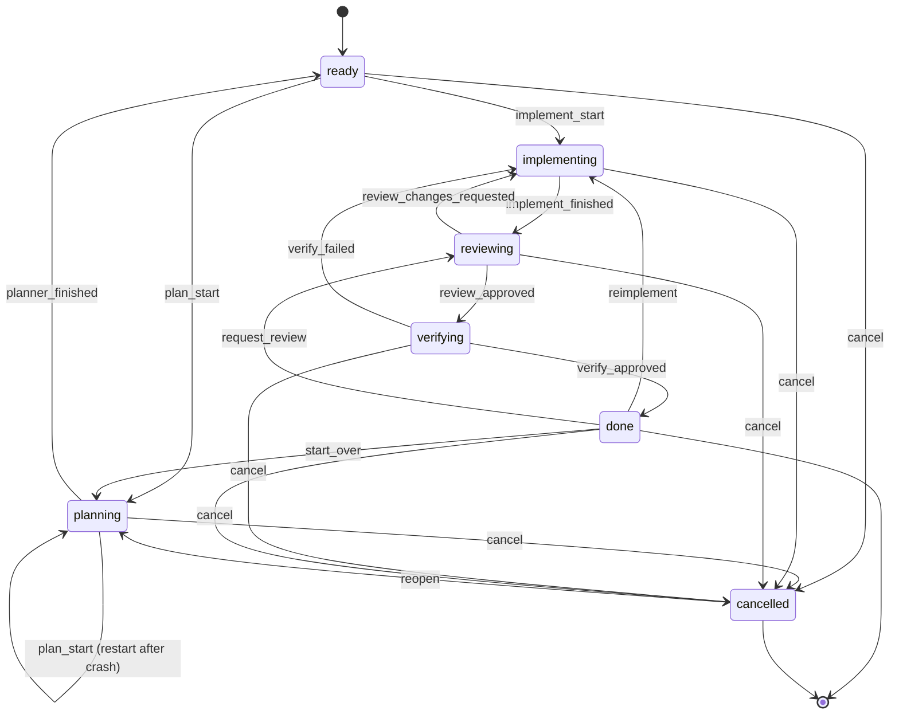

# lifecycle

every task in kasmos moves through a finite state machine (fsm). the fsm validates all transitions, writes new status to the task store, and records phase timestamps.

## statuses

| status | meaning |
|--------|---------|
| `ready` | task is registered and waiting to start |
| `planning` | a planner agent is writing the plan content |
| `implementing` | coder agents are working on the task |
| `reviewing` | a reviewer agent is checking the implementation |
| `verifying` | a master agent is running the holistic readiness gate before `done` (only entered when `auto_readiness_review = true`); the verify loop is capped by `readiness_max_verify_cycles` — when the cap is reached, the processor consumes the next `verify_failed` signal but applies the `verifying → done` transition directly instead of looping back to `implementing` |
| `done` | the task is complete and merged (or ready to merge) |
| `cancelled` | explicitly stopped; can be reopened |

## execution phases

while `status` is the coarse lifecycle stage, tasks in the `implementing` and adjacent states carry a finer-grained `ExecutionPhase` that records where the orchestration engine is within that stage.

| phase | meaning |
|-------|---------|
| `planned` | planner finished; task is ready to start implementation |
| `architecting` | architect agent is decomposing the plan into waves |
| `wave_running` | at least one wave of coder agents is running |
| `wave_waiting` | current wave finished; waiting for the next wave gate |
| `single_agent_implementing` | running as a single coder (no wave decomposition) |
| `fixing` | fixer/remediation agent is addressing review feedback |
| `reviewing` | reviewer agent is active |

### how phases are set

the `planner_finished` event writes `ExecutionState{Phase: "planned"}`. all other events leave the phase empty; the orchestration engine writes it directly as agent sessions advance.

### draft-ready vs planned-ready

a `ready` task can be in one of two substates:

- **draft-ready** — `status: ready`, `execution_phase: ""` (empty). the task has been registered but the planner has not yet finished. `implement_start` is **rejected** for draft-ready tasks — both `kas task implement` and the tui's "implement" action return an error (`"task is ready but not yet planned"`).
- **planned-ready** — `status: ready`, `execution_phase: "planned"`. the planner finished successfully and the task is safe to hand off to coder agents.

## events

events trigger transitions. some events are **user-only** (can only be fired from the tui or cli) and cannot be emitted as agent signals.

| event | user-only | description |
|-------|-----------|-------------|
| `plan_start` | no | start or restart a planner agent |
| `planner_finished` | no | planner agent signalled completion |
| `implement_start` | no | start coder agents |
| `implement_finished` | no | all coders signalled completion |
| `request_review` | **yes** | manually trigger a reviewer |
| `review_approved` | no | reviewer approved the implementation; routes `reviewing → verifying` when `auto_readiness_review = true`, otherwise `reviewing → done` |
| `review_changes_requested` | no | reviewer requested changes |
| `verify_approved` | no | master agent approved during verifying (→ `done`). the daemon never writes a `verify_approved` signal row itself — see `verify_failed` for loop-cap handling |
| `verify_failed` | no | master agent requested changes during verifying (→ `implementing`). when the verify-round count reaches `readiness_max_verify_cycles` the processor still consumes this `verify_failed` signal but applies the `verifying → done` transition directly instead; no new signal is emitted, and the processor tags the emitted `VerifyApprovedAction` as `ForcePromoted` so the tui can surface a warning |
| `start_over` | **yes** | reset to planning from done |
| `reimplement` | **yes** | resume implementation from done without resetting branch |
| `cancel` | **yes** | cancel the task from any active status |
| `reopen` | **yes** | reopen a cancelled task back to planning |

> **verifying signals:** `verify_approved` and `verify_failed` are the canonical signal names emitted by the master agent. deprecated aliases are accepted at ingress and canonicalized: `readiness_approved` → `verify_approved`; `readiness_changes_requested` / `readiness-changes` / `readiness-changes-requested` / `master_approved` → `verify_failed`.

## state diagram

the following diagram shows all valid task status transitions:



## transition table

```
ready
  ├─ plan_start          → planning
  ├─ implement_start     → implementing
  └─ cancel              → cancelled

planning
  ├─ plan_start          → planning   (restart after crash)
  ├─ planner_finished    → ready
  └─ cancel              → cancelled

implementing
  ├─ implement_finished  → reviewing
  └─ cancel              → cancelled

reviewing
  ├─ review_approved     → verifying  (when auto_readiness_review=true)
  │                      → done       (when auto_readiness_review=false)
  ├─ review_changes_requested → implementing
  └─ cancel              → cancelled

verifying
  ├─ verify_approved     → done
  ├─ verify_failed       → implementing
  └─ cancel              → cancelled

done
  ├─ start_over          → planning
  ├─ reimplement         → implementing
  ├─ request_review      → reviewing
  └─ cancel              → cancelled

cancelled
  └─ reopen              → planning
```

## phase timestamps

when the fsm writes a new status, it also records a timestamp for that phase in the task store. these power the timeline view in the tui's info pane:

| status reached | timestamp field |
|----------------|-----------------|
| `planning` | `planning_at` |
| `implementing` | `implementing_at` |
| `reviewing` | `reviewing_at` |
| `verifying` | `verifying_at` |
| `done` | `done_at` |

## triggering transitions

### from the tui

select a task and press `↵` (enter) to open the context menu. available actions depend on the current status (e.g. "start planner", "implement", "review", "cancel").

### from the cli

```bash
kas task transition <task-file> <event>
```

examples:

```bash
kas task transition my-feature plan_start
kas task transition my-feature implement_start
kas task transition my-feature cancel
kas task transition my-feature reopen
```

### from agents (signals)

agents should emit **agent signals** via mcp `signal_create`. the signal is written to the sqlite-backed signals table and picked up by the daemon, which drives fsm transitions. `kas signal emit` is the operator and cli fallback. a compatibility path also exists: signals written as files under `.kasmos/signals/` can be processed by `kas signal process`. on daemon startup, kasmos only recovers any files left in `.kasmos/signals/processing/` back to the root; file-based signals are then bridged/processed on subsequent daemon ticks. either way, the orchestration loop claims pending signals atomically before calling `Transition()` on the fsm.

## forcing a status

for recovery when signals fail or the fsm gets stuck:

```bash
kas task set-status <task-file> <status> --force
```

this bypasses transition validation and writes directly to the store.
